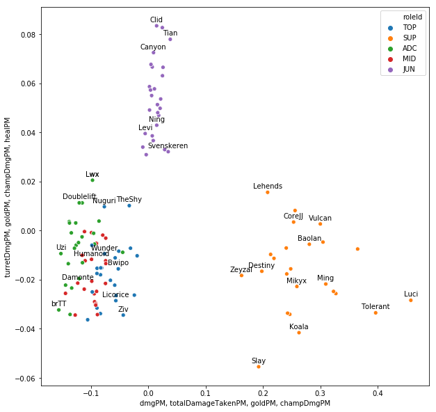

```python
import requests as req
import pandas as pd
import numpy as np
import json
import mysql.connector
import time
import random
import math
import seaborn as sns
import matplotlib.pyplot as plt
from sklearn import tree
from sklearn import decomposition
from sklearn import preprocessing
from sklearn import ensemble
from scipy import cluster
import rfvis
```


```python
pd.set_option('display.max_rows', 150)
pd.set_option('display.max_columns', 150)
pd.set_option('display.width', 1000)
```


```python
query = """
SELECT
  MAX(Player.team) as team,
  Player.name,
  MAX((Player.participantId-1)%5) as roleId,
  COUNT(*) as gamesPlayed,
  AVG(Team.win) as winRate,
  AVG(Game.duration/60) as gameDurationAVG,
  AVG(kills/(Game.duration/60)) as killsPM,
  AVG(deaths/(Game.duration/60)) as deathsPM,
  AVG(assists/(Game.duration/60)) as assistsPM,
  AVG((assists+kills)/(Game.duration/60)) as kpPM,
  AVG(totalDamageDealt/(Game.duration/60)) as dmgPM,
  AVG(damageDealtToTurrets/(Game.duration/60)) as turretDmgPM,
  AVG(damageDealtToObjectives/(Game.duration/60)) as turretDmgPM,
  AVG(totalDamageDealtToChampions/(Game.duration/60)) as champDmgPM,
  AVG(magicDamageDealtToChampions/totalDamageDealtToChampions) as magicDmgPART,
  AVG(physicalDamageDealtToChampions/totalDamageDealtToChampions) as physicalDmgPART,
  AVG(totalHeal/(Game.duration/60)) as healPM,
  AVG(visionScore/(Game.duration/60)) as visionPM,
  AVG(timeCCingOthers/(Game.duration)) as ccPART,
  AVG(goldEarned/(Game.duration/60)) as goldPM,
  AVG(totalDamageTaken/(Game.duration/60)) as totalDamageTakenPM,
  AVG(turretKills) as turretsAVG,
  AVG(Player.inhibitorKills/(Game.duration/60)) as inhibPM,
  AVG((totalMinionsKilled+neutralMinionsKilled)/(Game.duration/60)) as csPM,
  AVG(neutralMinionsKilled) as jglPM,
  AVG(neutralMinionsKilledEnemyJungle) as counterJglPM,
  AVG(wardsPlaced/(Game.duration/60)) as wardPlacedPM,
  AVG(wardsKilled/(Game.duration/60)) as wardsKilledPM,
  AVG(firstBloodKill+firstBloodAssist) as firstBloodPresenceAVG
FROM Player
INNER JOIN Team ON Player.gameId=Team.gameId AND Player.platformId=Team.platformId AND Player.side=Team.side
INNER JOIN GameMetadata ON Team.gameId=GameMetadata.gameId AND Team.platformId=GameMetadata.platformId
INNER JOIN Game ON Team.gameId=Game.gameId AND Team.platformId=Game.platformId
WHERE GameMetadata.league="WC"
GROUP BY Player.name
HAVING COUNT(*)>=3
ORDER BY winRate DESC;
"""
```


```python
with open('../safe_connector.json') as _:
    dbc = json.load(_)
cnx = mysql.connector.connect(**dbc)
cur = cnx.cursor(dictionary=True)
cur.execute(query)
res = cur.fetchall()
stats = pd.DataFrame(res).set_index("name")
cnx.close()
stats = stats.apply(pd.to_numeric, errors='ignore').fillna(0)
stats["roleId"] = stats["roleId"].apply(lambda x : ["TOP", "JUN", "MID", "ADC", "SUP"][x])
```


```python
stats
```


<div>
<style scoped>
    .dataframe tbody tr th:only-of-type {
        vertical-align: middle;
    }

    .dataframe tbody tr th {
        vertical-align: top;
    }

    .dataframe thead th {
        text-align: right;
    }
</style>
<table border="1" class="dataframe">
  <thead>
    <tr style="text-align: right;">
      <th></th>
      <th>team</th>
      <th>roleId</th>
      <th>gamesPlayed</th>
      <th>winRate</th>
      <th>gameDurationAVG</th>
      <th>killsPM</th>
      <th>deathsPM</th>
      <th>assistsPM</th>
      <th>kpPM</th>
      <th>dmgPM</th>
      <th>turretDmgPM</th>
      <th>champDmgPM</th>
      <th>magicDmgPART</th>
      <th>physicalDmgPART</th>
      <th>healPM</th>
      <th>visionPM</th>
      <th>ccPART</th>
      <th>goldPM</th>
      <th>totalDamageTakenPM</th>
      <th>turretsAVG</th>
      <th>inhibPM</th>
      <th>csPM</th>
      <th>jglPM</th>
      <th>counterJglPM</th>
      <th>wardPlacedPM</th>
      <th>wardsKilledPM</th>
      <th>firstBloodPresenceAVG</th>
    </tr>
    <tr>
      <th>name</th>
      <th></th>
      <th></th>
      <th></th>
      <th></th>
      <th></th>
      <th></th>
      <th></th>
      <th></th>
      <th></th>
      <th></th>
      <th></th>
      <th></th>
      <th></th>
      <th></th>
      <th></th>
      <th></th>
      <th></th>
      <th></th>
      <th></th>
      <th></th>
      <th></th>
      <th></th>
      <th></th>
      <th></th>
      <th></th>
      <th></th>
      <th></th>
    </tr>
  </thead>
  <tbody>
    <tr>
      <th>GimGoon</th>
      <td>FPX</td>
      <td>TOP</td>
      <td>18</td>
      <td>0.7778</td>
      <td>31.259256</td>
      <td>0.091922</td>
      <td>0.067283</td>
      <td>0.212122</td>
      <td>0.304061</td>
      <td>5285.411972</td>
      <td>317.508711</td>
      <td>426.290294</td>
      <td>0.295794</td>
      <td>0.642694</td>
      <td>201.975606</td>
      <td>1.015694</td>
      <td>0.005733</td>
      <td>381.964278</td>
      <td>657.672606</td>
      <td>1.3889</td>
      <td>0.005633</td>
      <td>7.027267</td>
      <td>12.6111</td>
      <td>2.8333</td>
      <td>0.468433</td>
      <td>0.182306</td>
      <td>0.2778</td>
    </tr>
    <tr>
      <th>Crisp</th>
      <td>FPX</td>
      <td>SUP</td>
      <td>18</td>
      <td>0.7778</td>
      <td>31.259256</td>
      <td>0.040194</td>
      <td>0.067717</td>
      <td>0.389611</td>
      <td>0.429806</td>
      <td>974.106372</td>
      <td>91.615822</td>
      <td>144.136228</td>
      <td>0.761506</td>
      <td>0.134856</td>
      <td>95.769856</td>
      <td>2.506017</td>
      <td>0.011394</td>
      <td>278.126550</td>
      <td>378.309822</td>
      <td>0.2222</td>
      <td>0.003861</td>
      <td>1.533611</td>
      <td>0.0000</td>
      <td>0.0000</td>
      <td>1.675317</td>
      <td>0.314133</td>
      <td>0.0556</td>
    </tr>
    <tr>
      <th>Lwx</th>
      <td>FPX</td>
      <td>ADC</td>
      <td>18</td>
      <td>0.7778</td>
      <td>31.259256</td>
      <td>0.198244</td>
      <td>0.067767</td>
      <td>0.208267</td>
      <td>0.406506</td>
      <td>6480.945900</td>
      <td>717.616861</td>
      <td>495.347644</td>
      <td>0.217550</td>
      <td>0.741694</td>
      <td>44.019567</td>
      <td>1.138472</td>
      <td>0.004383</td>
      <td>482.764983</td>
      <td>341.204667</td>
      <td>2.3333</td>
      <td>0.011594</td>
      <td>9.584750</td>
      <td>27.5000</td>
      <td>2.4444</td>
      <td>0.331317</td>
      <td>0.347250</td>
      <td>0.1111</td>
    </tr>
    <tr>
      <th>Doinb</th>
      <td>FPX</td>
      <td>MID</td>
      <td>18</td>
      <td>0.7778</td>
      <td>31.259256</td>
      <td>0.144717</td>
      <td>0.059706</td>
      <td>0.279333</td>
      <td>0.424050</td>
      <td>6560.909428</td>
      <td>420.566450</td>
      <td>500.808028</td>
      <td>0.796783</td>
      <td>0.195656</td>
      <td>177.737067</td>
      <td>1.151856</td>
      <td>0.013067</td>
      <td>434.632928</td>
      <td>549.091972</td>
      <td>1.3333</td>
      <td>0.004300</td>
      <td>8.614017</td>
      <td>35.3889</td>
      <td>7.0000</td>
      <td>0.439583</td>
      <td>0.231294</td>
      <td>0.0556</td>
    </tr>
    <tr>
      <th>Tian</th>
      <td>FPX</td>
      <td>JUN</td>
      <td>18</td>
      <td>0.7778</td>
      <td>31.259256</td>
      <td>0.134767</td>
      <td>0.076072</td>
      <td>0.279228</td>
      <td>0.414000</td>
      <td>4835.734306</td>
      <td>902.160922</td>
      <td>367.389406</td>
      <td>0.380144</td>
      <td>0.533278</td>
      <td>354.396589</td>
      <td>2.142922</td>
      <td>0.008439</td>
      <td>370.358883</td>
      <td>761.095339</td>
      <td>0.8889</td>
      <td>0.002328</td>
      <td>5.327733</td>
      <td>128.2778</td>
      <td>14.5000</td>
      <td>1.081728</td>
      <td>0.505094</td>
      <td>0.1667</td>
    </tr>
    <tr>
      <th>Effort</th>
      <td>SKT</td>
      <td>SUP</td>
      <td>12</td>
      <td>0.7500</td>
      <td>32.740283</td>
      <td>0.019358</td>
      <td>0.107900</td>
      <td>0.246867</td>
      <td>0.266225</td>
      <td>867.007833</td>
      <td>103.841308</td>
      <td>132.388542</td>
      <td>0.687875</td>
      <td>0.133075</td>
      <td>67.107758</td>
      <td>2.708650</td>
      <td>0.011242</td>
      <td>257.457108</td>
      <td>383.155267</td>
      <td>0.5833</td>
      <td>0.000000</td>
      <td>1.318158</td>
      <td>0.0000</td>
      <td>0.0000</td>
      <td>1.813700</td>
      <td>0.397800</td>
      <td>0.0000</td>
    </tr>
    <tr>
      <th>Nuclear</th>
      <td>DWG</td>
      <td>ADC</td>
      <td>18</td>
      <td>0.7222</td>
      <td>32.124078</td>
      <td>0.142339</td>
      <td>0.052506</td>
      <td>0.178839</td>
      <td>0.321183</td>
      <td>6206.013250</td>
      <td>577.857094</td>
      <td>343.484739</td>
      <td>0.307394</td>
      <td>0.667567</td>
      <td>53.774378</td>
      <td>1.221928</td>
      <td>0.003050</td>
      <td>452.579900</td>
      <td>340.417283</td>
      <td>1.7222</td>
      <td>0.005106</td>
      <td>9.337489</td>
      <td>27.2222</td>
      <td>3.5556</td>
      <td>0.457522</td>
      <td>0.313389</td>
      <td>0.1667</td>
    </tr>
    <tr>
      <th>ShowMaker</th>
      <td>DWG</td>
      <td>MID</td>
      <td>18</td>
      <td>0.7222</td>
      <td>32.124078</td>
      <td>0.133022</td>
      <td>0.038389</td>
      <td>0.167294</td>
      <td>0.300328</td>
      <td>5595.454650</td>
      <td>349.099672</td>
      <td>387.593456</td>
      <td>0.644594</td>
      <td>0.329550</td>
      <td>188.491878</td>
      <td>1.176172</td>
      <td>0.003522</td>
      <td>420.651533</td>
      <td>427.962844</td>
      <td>1.0000</td>
      <td>0.009850</td>
      <td>8.627594</td>
      <td>19.8333</td>
      <td>3.8889</td>
      <td>0.441078</td>
      <td>0.292017</td>
      <td>0.0000</td>
    </tr>
    <tr>
      <th>Canyon</th>
      <td>DWG</td>
      <td>JUN</td>
      <td>18</td>
      <td>0.7222</td>
      <td>32.124078</td>
      <td>0.087917</td>
      <td>0.063356</td>
      <td>0.218294</td>
      <td>0.306217</td>
      <td>4716.821222</td>
      <td>825.759650</td>
      <td>313.238772</td>
      <td>0.380344</td>
      <td>0.535978</td>
      <td>262.523961</td>
      <td>1.731394</td>
      <td>0.005828</td>
      <td>342.990217</td>
      <td>624.268122</td>
      <td>0.8333</td>
      <td>0.004467</td>
      <td>5.075200</td>
      <td>133.3889</td>
      <td>12.4444</td>
      <td>0.790344</td>
      <td>0.396972</td>
      <td>0.1111</td>
    </tr>
    <tr>
      <th>Nuguri</th>
      <td>DWG</td>
      <td>TOP</td>
      <td>18</td>
      <td>0.7222</td>
      <td>32.124078</td>
      <td>0.081617</td>
      <td>0.083633</td>
      <td>0.173250</td>
      <td>0.254856</td>
      <td>6840.334256</td>
      <td>499.329706</td>
      <td>488.381317</td>
      <td>0.586122</td>
      <td>0.388383</td>
      <td>375.456994</td>
      <td>1.120856</td>
      <td>0.004522</td>
      <td>440.393306</td>
      <td>566.243133</td>
      <td>2.0556</td>
      <td>0.013417</td>
      <td>9.022622</td>
      <td>28.7222</td>
      <td>6.2222</td>
      <td>0.475300</td>
      <td>0.227906</td>
      <td>0.0000</td>
    </tr>
    <tr>
      <th>BeryL</th>
      <td>DWG</td>
      <td>SUP</td>
      <td>18</td>
      <td>0.7222</td>
      <td>32.124078</td>
      <td>0.024617</td>
      <td>0.079750</td>
      <td>0.303361</td>
      <td>0.327978</td>
      <td>1053.600433</td>
      <td>82.615550</td>
      <td>195.661067</td>
      <td>0.651772</td>
      <td>0.229144</td>
      <td>139.838306</td>
      <td>2.720944</td>
      <td>0.009856</td>
      <td>273.533594</td>
      <td>378.168311</td>
      <td>0.2778</td>
      <td>0.001606</td>
      <td>1.711800</td>
      <td>0.5000</td>
      <td>0.5000</td>
      <td>1.715044</td>
      <td>0.445911</td>
      <td>0.0000</td>
    </tr>
    <tr>
      <th>Leyan</th>
      <td>IG</td>
      <td>JUN</td>
      <td>3</td>
      <td>0.6667</td>
      <td>33.894433</td>
      <td>0.057133</td>
      <td>0.064467</td>
      <td>0.140600</td>
      <td>0.197733</td>
      <td>4995.650867</td>
      <td>761.725067</td>
      <td>261.096267</td>
      <td>0.644967</td>
      <td>0.240667</td>
      <td>391.928967</td>
      <td>2.171267</td>
      <td>0.005200</td>
      <td>328.591533</td>
      <td>720.532333</td>
      <td>1.3333</td>
      <td>0.011233</td>
      <td>5.165133</td>
      <td>137.3333</td>
      <td>12.6667</td>
      <td>0.789533</td>
      <td>0.573733</td>
      <td>0.0000</td>
    </tr>
    <tr>
      <th>Khan</th>
      <td>SKT</td>
      <td>TOP</td>
      <td>14</td>
      <td>0.6429</td>
      <td>32.908343</td>
      <td>0.132621</td>
      <td>0.073107</td>
      <td>0.145721</td>
      <td>0.278357</td>
      <td>6203.742479</td>
      <td>290.521921</td>
      <td>507.591071</td>
      <td>0.323286</td>
      <td>0.611993</td>
      <td>340.855236</td>
      <td>1.296229</td>
      <td>0.006350</td>
      <td>427.344500</td>
      <td>709.396850</td>
      <td>0.9286</td>
      <td>0.000000</td>
      <td>8.185071</td>
      <td>22.5714</td>
      <td>5.2143</td>
      <td>0.598093</td>
      <td>0.264343</td>
      <td>0.2143</td>
    </tr>
    <tr>
      <th>Teddy</th>
      <td>SKT</td>
      <td>ADC</td>
      <td>14</td>
      <td>0.6429</td>
      <td>32.908343</td>
      <td>0.129329</td>
      <td>0.047879</td>
      <td>0.188743</td>
      <td>0.318071</td>
      <td>6836.553271</td>
      <td>545.935436</td>
      <td>432.351621</td>
      <td>0.291821</td>
      <td>0.684364</td>
      <td>73.267514</td>
      <td>1.343964</td>
      <td>0.004236</td>
      <td>468.122929</td>
      <td>318.602857</td>
      <td>1.7143</td>
      <td>0.004143</td>
      <td>9.940393</td>
      <td>33.1429</td>
      <td>2.4286</td>
      <td>0.458257</td>
      <td>0.354843</td>
      <td>0.1429</td>
    </tr>
    <tr>
      <th>Faker</th>
      <td>SKT</td>
      <td>MID</td>
      <td>14</td>
      <td>0.6429</td>
      <td>32.908343</td>
      <td>0.111329</td>
      <td>0.072400</td>
      <td>0.164857</td>
      <td>0.276171</td>
      <td>6053.816729</td>
      <td>447.313636</td>
      <td>401.418443</td>
      <td>0.682829</td>
      <td>0.293936</td>
      <td>113.240736</td>
      <td>1.135771</td>
      <td>0.006664</td>
      <td>425.893271</td>
      <td>457.156036</td>
      <td>1.5714</td>
      <td>0.010986</td>
      <td>8.824671</td>
      <td>24.8571</td>
      <td>5.0000</td>
      <td>0.540964</td>
      <td>0.279186</td>
      <td>0.1429</td>
    </tr>
    <tr>
      <th>Clid</th>
      <td>SKT</td>
      <td>JUN</td>
      <td>14</td>
      <td>0.6429</td>
      <td>32.908343</td>
      <td>0.076914</td>
      <td>0.069264</td>
      <td>0.234386</td>
      <td>0.311307</td>
      <td>4767.321936</td>
      <td>915.671000</td>
      <td>284.400064</td>
      <td>0.496179</td>
      <td>0.422457</td>
      <td>286.418636</td>
      <td>2.194464</td>
      <td>0.007050</td>
      <td>342.224443</td>
      <td>640.540064</td>
      <td>1.0714</td>
      <td>0.009721</td>
      <td>5.174779</td>
      <td>134.8571</td>
      <td>13.5714</td>
      <td>1.001421</td>
      <td>0.443714</td>
      <td>0.1429</td>
    </tr>
    <tr>
      <th>Viper</th>
      <td>GRF</td>
      <td>ADC</td>
      <td>11</td>
      <td>0.6364</td>
      <td>32.887882</td>
      <td>0.147909</td>
      <td>0.036755</td>
      <td>0.181945</td>
      <td>0.329864</td>
      <td>6237.125955</td>
      <td>532.683400</td>
      <td>438.904518</td>
      <td>0.176245</td>
      <td>0.769300</td>
      <td>83.068364</td>
      <td>1.527073</td>
      <td>0.004973</td>
      <td>453.553945</td>
      <td>533.046327</td>
      <td>1.4545</td>
      <td>0.007909</td>
      <td>9.448318</td>
      <td>20.4545</td>
      <td>4.1818</td>
      <td>0.645391</td>
      <td>0.350055</td>
      <td>0.1818</td>
    </tr>
    <tr>
      <th>Chovy</th>
      <td>GRF</td>
      <td>MID</td>
      <td>11</td>
      <td>0.6364</td>
      <td>32.887882</td>
      <td>0.086155</td>
      <td>0.042873</td>
      <td>0.181091</td>
      <td>0.267236</td>
      <td>5529.009264</td>
      <td>330.600082</td>
      <td>446.694036</td>
      <td>0.500564</td>
      <td>0.437118</td>
      <td>124.920173</td>
      <td>1.346145</td>
      <td>0.007873</td>
      <td>398.903118</td>
      <td>570.738227</td>
      <td>1.5455</td>
      <td>0.003018</td>
      <td>8.736300</td>
      <td>18.8182</td>
      <td>2.9091</td>
      <td>0.479627</td>
      <td>0.381255</td>
      <td>0.0000</td>
    </tr>
    <tr>
      <th>Tarzan</th>
      <td>GRF</td>
      <td>JUN</td>
      <td>11</td>
      <td>0.6364</td>
      <td>32.887882</td>
      <td>0.119927</td>
      <td>0.068118</td>
      <td>0.214845</td>
      <td>0.334745</td>
      <td>4973.082200</td>
      <td>825.002836</td>
      <td>348.062827</td>
      <td>0.502809</td>
      <td>0.419255</td>
      <td>276.331600</td>
      <td>2.023136</td>
      <td>0.007918</td>
      <td>350.126855</td>
      <td>649.714791</td>
      <td>0.4545</td>
      <td>0.000000</td>
      <td>5.376909</td>
      <td>147.1818</td>
      <td>7.0000</td>
      <td>1.002045</td>
      <td>0.375191</td>
      <td>0.4545</td>
    </tr>
    <tr>
      <th>Sword</th>
      <td>GRF</td>
      <td>TOP</td>
      <td>11</td>
      <td>0.6364</td>
      <td>32.887882</td>
      <td>0.101555</td>
      <td>0.091564</td>
      <td>0.183618</td>
      <td>0.285145</td>
      <td>5439.235382</td>
      <td>300.621936</td>
      <td>444.883436</td>
      <td>0.291600</td>
      <td>0.691545</td>
      <td>124.507382</td>
      <td>1.170445</td>
      <td>0.005418</td>
      <td>384.339882</td>
      <td>530.121055</td>
      <td>1.3636</td>
      <td>0.008836</td>
      <td>7.617436</td>
      <td>13.1818</td>
      <td>3.3636</td>
      <td>0.521855</td>
      <td>0.270936</td>
      <td>0.0000</td>
    </tr>
    <tr>
      <th>Lehends</th>
      <td>GRF</td>
      <td>SUP</td>
      <td>11</td>
      <td>0.6364</td>
      <td>32.887882</td>
      <td>0.028636</td>
      <td>0.044409</td>
      <td>0.351127</td>
      <td>0.379764</td>
      <td>1101.238364</td>
      <td>127.239036</td>
      <td>327.407327</td>
      <td>0.757145</td>
      <td>0.172045</td>
      <td>209.864936</td>
      <td>2.701582</td>
      <td>0.012573</td>
      <td>286.430709</td>
      <td>255.975709</td>
      <td>0.3636</td>
      <td>0.005109</td>
      <td>1.592055</td>
      <td>1.0909</td>
      <td>0.3636</td>
      <td>1.560673</td>
      <td>0.401382</td>
      <td>0.0000</td>
    </tr>
    <tr>
      <th>Caps</th>
      <td>G2</td>
      <td>MID</td>
      <td>18</td>
      <td>0.6111</td>
      <td>32.208344</td>
      <td>0.102256</td>
      <td>0.077806</td>
      <td>0.168272</td>
      <td>0.270533</td>
      <td>6555.201694</td>
      <td>381.880489</td>
      <td>426.446050</td>
      <td>0.753139</td>
      <td>0.216683</td>
      <td>124.037300</td>
      <td>0.963133</td>
      <td>0.009250</td>
      <td>409.889356</td>
      <td>470.388450</td>
      <td>1.5000</td>
      <td>0.010561</td>
      <td>8.595261</td>
      <td>30.1111</td>
      <td>7.0556</td>
      <td>0.426533</td>
      <td>0.178467</td>
      <td>0.1667</td>
    </tr>
    <tr>
      <th>Jankos</th>
      <td>G2</td>
      <td>JUN</td>
      <td>18</td>
      <td>0.6111</td>
      <td>32.208344</td>
      <td>0.085561</td>
      <td>0.088139</td>
      <td>0.165889</td>
      <td>0.251444</td>
      <td>4068.664067</td>
      <td>523.835311</td>
      <td>258.158700</td>
      <td>0.354467</td>
      <td>0.499333</td>
      <td>279.733483</td>
      <td>2.314439</td>
      <td>0.006328</td>
      <td>328.496967</td>
      <td>645.316550</td>
      <td>0.8333</td>
      <td>0.007594</td>
      <td>4.906428</td>
      <td>122.7222</td>
      <td>10.9444</td>
      <td>1.004372</td>
      <td>0.551183</td>
      <td>0.1667</td>
    </tr>
    <tr>
      <th>Wunder</th>
      <td>G2</td>
      <td>TOP</td>
      <td>18</td>
      <td>0.6111</td>
      <td>32.208344</td>
      <td>0.068500</td>
      <td>0.096883</td>
      <td>0.148839</td>
      <td>0.217322</td>
      <td>5731.295783</td>
      <td>323.203261</td>
      <td>409.554750</td>
      <td>0.568278</td>
      <td>0.411617</td>
      <td>201.906789</td>
      <td>0.964850</td>
      <td>0.005428</td>
      <td>389.613922</td>
      <td>596.820822</td>
      <td>1.0000</td>
      <td>0.008383</td>
      <td>8.171456</td>
      <td>17.4444</td>
      <td>2.2222</td>
      <td>0.459594</td>
      <td>0.143483</td>
      <td>0.1111</td>
    </tr>
    <tr>
      <th>Mikyx</th>
      <td>G2</td>
      <td>SUP</td>
      <td>18</td>
      <td>0.6111</td>
      <td>32.208344</td>
      <td>0.021711</td>
      <td>0.102428</td>
      <td>0.231061</td>
      <td>0.252778</td>
      <td>777.303022</td>
      <td>61.188661</td>
      <td>157.083044</td>
      <td>0.716539</td>
      <td>0.154917</td>
      <td>80.185678</td>
      <td>2.900961</td>
      <td>0.010367</td>
      <td>246.613111</td>
      <td>355.360411</td>
      <td>0.1667</td>
      <td>0.002256</td>
      <td>1.343056</td>
      <td>0.4444</td>
      <td>0.2222</td>
      <td>1.715911</td>
      <td>0.475411</td>
      <td>0.1111</td>
    </tr>
    <tr>
      <th>Perkz</th>
      <td>G2</td>
      <td>ADC</td>
      <td>18</td>
      <td>0.6111</td>
      <td>32.208344</td>
      <td>0.148450</td>
      <td>0.084428</td>
      <td>0.112667</td>
      <td>0.261106</td>
      <td>7012.019850</td>
      <td>488.459789</td>
      <td>450.135917</td>
      <td>0.241844</td>
      <td>0.728700</td>
      <td>46.795761</td>
      <td>1.273650</td>
      <td>0.005611</td>
      <td>464.051811</td>
      <td>408.397828</td>
      <td>1.8889</td>
      <td>0.004961</td>
      <td>9.939089</td>
      <td>34.5556</td>
      <td>6.2222</td>
      <td>0.426978</td>
      <td>0.420478</td>
      <td>0.1111</td>
    </tr>
    <tr>
      <th>TheShy</th>
      <td>IG</td>
      <td>TOP</td>
      <td>14</td>
      <td>0.5714</td>
      <td>33.058336</td>
      <td>0.118807</td>
      <td>0.099350</td>
      <td>0.191529</td>
      <td>0.310336</td>
      <td>5916.512036</td>
      <td>455.725079</td>
      <td>590.676729</td>
      <td>0.536193</td>
      <td>0.449886</td>
      <td>389.221664</td>
      <td>0.774879</td>
      <td>0.003750</td>
      <td>424.503400</td>
      <td>650.900993</td>
      <td>1.1429</td>
      <td>0.007214</td>
      <td>8.241229</td>
      <td>23.6429</td>
      <td>1.7143</td>
      <td>0.394400</td>
      <td>0.122579</td>
      <td>0.1429</td>
    </tr>
    <tr>
      <th>Baolan</th>
      <td>IG</td>
      <td>SUP</td>
      <td>14</td>
      <td>0.5714</td>
      <td>33.058336</td>
      <td>0.018750</td>
      <td>0.104386</td>
      <td>0.222514</td>
      <td>0.241271</td>
      <td>711.115729</td>
      <td>72.530193</td>
      <td>129.992721</td>
      <td>0.752771</td>
      <td>0.119000</td>
      <td>106.638479</td>
      <td>2.815150</td>
      <td>0.013886</td>
      <td>231.140836</td>
      <td>358.127643</td>
      <td>0.2857</td>
      <td>0.000000</td>
      <td>1.303493</td>
      <td>0.3571</td>
      <td>0.0714</td>
      <td>1.726029</td>
      <td>0.479357</td>
      <td>0.0000</td>
    </tr>
    <tr>
      <th>JackeyLove</th>
      <td>IG</td>
      <td>ADC</td>
      <td>14</td>
      <td>0.5714</td>
      <td>33.058336</td>
      <td>0.137986</td>
      <td>0.080729</td>
      <td>0.141050</td>
      <td>0.279021</td>
      <td>6082.777971</td>
      <td>489.642879</td>
      <td>514.631450</td>
      <td>0.338614</td>
      <td>0.633057</td>
      <td>49.983714</td>
      <td>1.126564</td>
      <td>0.002957</td>
      <td>443.200171</td>
      <td>417.558714</td>
      <td>1.5714</td>
      <td>0.006600</td>
      <td>9.474043</td>
      <td>24.5714</td>
      <td>3.6429</td>
      <td>0.339386</td>
      <td>0.387171</td>
      <td>0.0714</td>
    </tr>
    <tr>
      <th>Rookie</th>
      <td>IG</td>
      <td>MID</td>
      <td>14</td>
      <td>0.5714</td>
      <td>33.058336</td>
      <td>0.115379</td>
      <td>0.076893</td>
      <td>0.215764</td>
      <td>0.331143</td>
      <td>5276.443914</td>
      <td>246.410736</td>
      <td>528.668264</td>
      <td>0.449864</td>
      <td>0.532336</td>
      <td>128.905329</td>
      <td>1.150143</td>
      <td>0.007643</td>
      <td>397.549279</td>
      <td>484.846907</td>
      <td>0.5714</td>
      <td>0.005557</td>
      <td>7.939686</td>
      <td>26.9286</td>
      <td>2.2143</td>
      <td>0.369050</td>
      <td>0.312286</td>
      <td>0.0714</td>
    </tr>
    <tr>
      <th>Norskeren</th>
      <td>SPY</td>
      <td>SUP</td>
      <td>20</td>
      <td>0.5500</td>
      <td>34.105000</td>
      <td>0.014315</td>
      <td>0.087060</td>
      <td>0.260210</td>
      <td>0.274520</td>
      <td>620.334355</td>
      <td>91.303085</td>
      <td>129.339975</td>
      <td>0.636030</td>
      <td>0.198920</td>
      <td>59.770620</td>
      <td>2.778155</td>
      <td>0.009805</td>
      <td>248.096460</td>
      <td>326.185615</td>
      <td>0.0000</td>
      <td>0.001320</td>
      <td>0.966730</td>
      <td>0.2000</td>
      <td>0.0000</td>
      <td>1.500420</td>
      <td>0.444775</td>
      <td>0.0500</td>
    </tr>
    <tr>
      <th>Kobbe</th>
      <td>SPY</td>
      <td>ADC</td>
      <td>20</td>
      <td>0.5500</td>
      <td>34.105000</td>
      <td>0.144155</td>
      <td>0.045715</td>
      <td>0.134130</td>
      <td>0.278305</td>
      <td>7329.840500</td>
      <td>547.732075</td>
      <td>450.877940</td>
      <td>0.281420</td>
      <td>0.700295</td>
      <td>50.823880</td>
      <td>1.072900</td>
      <td>0.003800</td>
      <td>466.635395</td>
      <td>354.890120</td>
      <td>1.9000</td>
      <td>0.004900</td>
      <td>9.958715</td>
      <td>32.9000</td>
      <td>4.3500</td>
      <td>0.297705</td>
      <td>0.334155</td>
      <td>0.0500</td>
    </tr>
    <tr>
      <th>Humanoid</th>
      <td>SPY</td>
      <td>MID</td>
      <td>20</td>
      <td>0.5500</td>
      <td>34.105000</td>
      <td>0.109610</td>
      <td>0.099430</td>
      <td>0.127855</td>
      <td>0.237465</td>
      <td>6641.828170</td>
      <td>357.713625</td>
      <td>488.481590</td>
      <td>0.862005</td>
      <td>0.125325</td>
      <td>180.522445</td>
      <td>0.975705</td>
      <td>0.007655</td>
      <td>418.499465</td>
      <td>550.954025</td>
      <td>1.0500</td>
      <td>0.007780</td>
      <td>9.102760</td>
      <td>30.4000</td>
      <td>6.6500</td>
      <td>0.481490</td>
      <td>0.217150</td>
      <td>0.0000</td>
    </tr>
    <tr>
      <th>Xerxe</th>
      <td>SPY</td>
      <td>JUN</td>
      <td>20</td>
      <td>0.5500</td>
      <td>34.105000</td>
      <td>0.104570</td>
      <td>0.062360</td>
      <td>0.185510</td>
      <td>0.290095</td>
      <td>4345.670510</td>
      <td>696.963990</td>
      <td>291.396595</td>
      <td>0.380585</td>
      <td>0.492710</td>
      <td>333.078030</td>
      <td>1.940075</td>
      <td>0.013700</td>
      <td>327.669680</td>
      <td>665.090760</td>
      <td>0.6500</td>
      <td>0.001460</td>
      <td>4.502810</td>
      <td>118.1000</td>
      <td>8.1000</td>
      <td>0.750880</td>
      <td>0.440770</td>
      <td>0.1500</td>
    </tr>
    <tr>
      <th>Vizicsacsi</th>
      <td>SPY</td>
      <td>TOP</td>
      <td>20</td>
      <td>0.5500</td>
      <td>34.105000</td>
      <td>0.071665</td>
      <td>0.088015</td>
      <td>0.176500</td>
      <td>0.248160</td>
      <td>5510.137780</td>
      <td>243.497920</td>
      <td>432.743915</td>
      <td>0.401170</td>
      <td>0.521350</td>
      <td>157.659895</td>
      <td>1.199770</td>
      <td>0.013040</td>
      <td>388.861695</td>
      <td>736.666290</td>
      <td>1.1500</td>
      <td>0.006570</td>
      <td>7.645505</td>
      <td>9.5000</td>
      <td>1.9500</td>
      <td>0.613085</td>
      <td>0.200095</td>
      <td>0.1000</td>
    </tr>
    <tr>
      <th>Ning</th>
      <td>IG</td>
      <td>JUN</td>
      <td>11</td>
      <td>0.5455</td>
      <td>32.830309</td>
      <td>0.062764</td>
      <td>0.128118</td>
      <td>0.220791</td>
      <td>0.283555</td>
      <td>4478.760645</td>
      <td>527.392245</td>
      <td>249.444336</td>
      <td>0.513118</td>
      <td>0.393900</td>
      <td>330.837236</td>
      <td>1.591364</td>
      <td>0.006800</td>
      <td>322.480691</td>
      <td>765.767918</td>
      <td>0.4545</td>
      <td>0.000000</td>
      <td>4.848873</td>
      <td>134.1818</td>
      <td>6.4545</td>
      <td>0.734255</td>
      <td>0.329518</td>
      <td>0.0000</td>
    </tr>
    <tr>
      <th>Hana</th>
      <td>JT</td>
      <td>JUN</td>
      <td>6</td>
      <td>0.5000</td>
      <td>33.263883</td>
      <td>0.014383</td>
      <td>0.094783</td>
      <td>0.214533</td>
      <td>0.228917</td>
      <td>3864.616133</td>
      <td>523.083983</td>
      <td>217.832417</td>
      <td>0.645683</td>
      <td>0.264267</td>
      <td>302.045517</td>
      <td>2.174250</td>
      <td>0.007000</td>
      <td>281.291283</td>
      <td>652.243200</td>
      <td>0.1667</td>
      <td>0.006217</td>
      <td>4.134083</td>
      <td>111.5000</td>
      <td>7.0000</td>
      <td>1.055350</td>
      <td>0.428267</td>
      <td>0.0000</td>
    </tr>
    <tr>
      <th>Broxah</th>
      <td>FNC</td>
      <td>JUN</td>
      <td>10</td>
      <td>0.5000</td>
      <td>33.260000</td>
      <td>0.081030</td>
      <td>0.049970</td>
      <td>0.198540</td>
      <td>0.279570</td>
      <td>3835.954770</td>
      <td>504.560310</td>
      <td>223.581000</td>
      <td>0.377350</td>
      <td>0.524960</td>
      <td>252.769840</td>
      <td>1.500820</td>
      <td>0.005260</td>
      <td>315.604030</td>
      <td>610.294710</td>
      <td>0.2000</td>
      <td>0.002060</td>
      <td>4.435440</td>
      <td>119.2000</td>
      <td>6.6000</td>
      <td>0.740140</td>
      <td>0.320350</td>
      <td>0.1000</td>
    </tr>
    <tr>
      <th>Langx</th>
      <td>RNG</td>
      <td>TOP</td>
      <td>6</td>
      <td>0.5000</td>
      <td>34.675000</td>
      <td>0.068717</td>
      <td>0.062483</td>
      <td>0.124350</td>
      <td>0.193067</td>
      <td>5896.788950</td>
      <td>269.519750</td>
      <td>366.392300</td>
      <td>0.365833</td>
      <td>0.620650</td>
      <td>181.134350</td>
      <td>0.995167</td>
      <td>0.006650</td>
      <td>402.128467</td>
      <td>655.596767</td>
      <td>1.1667</td>
      <td>0.010933</td>
      <td>8.525550</td>
      <td>22.3333</td>
      <td>2.8333</td>
      <td>0.474317</td>
      <td>0.186700</td>
      <td>0.0000</td>
    </tr>
    <tr>
      <th>Xmithie</th>
      <td>TL</td>
      <td>JUN</td>
      <td>6</td>
      <td>0.5000</td>
      <td>32.377767</td>
      <td>0.058433</td>
      <td>0.094300</td>
      <td>0.188700</td>
      <td>0.247083</td>
      <td>4224.902500</td>
      <td>461.545667</td>
      <td>241.406900</td>
      <td>0.504050</td>
      <td>0.434933</td>
      <td>296.086683</td>
      <td>1.681067</td>
      <td>0.007983</td>
      <td>309.618783</td>
      <td>706.704300</td>
      <td>0.3333</td>
      <td>0.000000</td>
      <td>4.775650</td>
      <td>122.0000</td>
      <td>3.5000</td>
      <td>0.689867</td>
      <td>0.366967</td>
      <td>0.3333</td>
    </tr>
    <tr>
      <th>Ming</th>
      <td>RNG</td>
      <td>SUP</td>
      <td>6</td>
      <td>0.5000</td>
      <td>34.675000</td>
      <td>0.036983</td>
      <td>0.082067</td>
      <td>0.248033</td>
      <td>0.285033</td>
      <td>627.589617</td>
      <td>84.680567</td>
      <td>162.872433</td>
      <td>0.782167</td>
      <td>0.123550</td>
      <td>34.593133</td>
      <td>2.749767</td>
      <td>0.008867</td>
      <td>264.447850</td>
      <td>336.596317</td>
      <td>0.0000</td>
      <td>0.004583</td>
      <td>0.700817</td>
      <td>0.6667</td>
      <td>0.6667</td>
      <td>1.908833</td>
      <td>0.344667</td>
      <td>0.0000</td>
    </tr>
    <tr>
      <th>Rest</th>
      <td>JT</td>
      <td>TOP</td>
      <td>6</td>
      <td>0.5000</td>
      <td>33.263883</td>
      <td>0.093750</td>
      <td>0.090950</td>
      <td>0.112133</td>
      <td>0.205883</td>
      <td>5812.929617</td>
      <td>155.518667</td>
      <td>448.382617</td>
      <td>0.255117</td>
      <td>0.691983</td>
      <td>159.777517</td>
      <td>0.800600</td>
      <td>0.009067</td>
      <td>381.531300</td>
      <td>685.139233</td>
      <td>0.8333</td>
      <td>0.000000</td>
      <td>7.611750</td>
      <td>14.0000</td>
      <td>0.6667</td>
      <td>0.391800</td>
      <td>0.089117</td>
      <td>0.1667</td>
    </tr>
    <tr>
      <th>Bwipo</th>
      <td>FNC</td>
      <td>TOP</td>
      <td>10</td>
      <td>0.5000</td>
      <td>33.260000</td>
      <td>0.090890</td>
      <td>0.112160</td>
      <td>0.170320</td>
      <td>0.261230</td>
      <td>5688.367940</td>
      <td>297.064130</td>
      <td>458.584530</td>
      <td>0.320660</td>
      <td>0.632840</td>
      <td>186.304880</td>
      <td>0.963750</td>
      <td>0.007000</td>
      <td>387.032090</td>
      <td>778.294600</td>
      <td>1.4000</td>
      <td>0.006270</td>
      <td>7.381230</td>
      <td>11.1000</td>
      <td>2.2000</td>
      <td>0.476570</td>
      <td>0.172510</td>
      <td>0.2000</td>
    </tr>
    <tr>
      <th>Impact</th>
      <td>TL</td>
      <td>TOP</td>
      <td>6</td>
      <td>0.5000</td>
      <td>32.377767</td>
      <td>0.054617</td>
      <td>0.093567</td>
      <td>0.101833</td>
      <td>0.156450</td>
      <td>5454.527283</td>
      <td>178.740683</td>
      <td>462.813083</td>
      <td>0.112617</td>
      <td>0.826983</td>
      <td>225.793583</td>
      <td>0.987800</td>
      <td>0.008200</td>
      <td>363.389100</td>
      <td>744.273400</td>
      <td>1.1667</td>
      <td>0.005367</td>
      <td>7.325700</td>
      <td>7.1667</td>
      <td>0.6667</td>
      <td>0.411033</td>
      <td>0.212083</td>
      <td>0.0000</td>
    </tr>
    <tr>
      <th>Koala</th>
      <td>JT</td>
      <td>SUP</td>
      <td>6</td>
      <td>0.5000</td>
      <td>33.263883</td>
      <td>0.024850</td>
      <td>0.118100</td>
      <td>0.197900</td>
      <td>0.222750</td>
      <td>701.167250</td>
      <td>27.805717</td>
      <td>112.384750</td>
      <td>0.585850</td>
      <td>0.223183</td>
      <td>69.871867</td>
      <td>2.723483</td>
      <td>0.011700</td>
      <td>232.841050</td>
      <td>351.974633</td>
      <td>0.0000</td>
      <td>0.000000</td>
      <td>1.229233</td>
      <td>0.6667</td>
      <td>0.0000</td>
      <td>1.840733</td>
      <td>0.318600</td>
      <td>0.1667</td>
    </tr>
    <tr>
      <th>Hylissang</th>
      <td>FNC</td>
      <td>SUP</td>
      <td>10</td>
      <td>0.5000</td>
      <td>33.260000</td>
      <td>0.050910</td>
      <td>0.150400</td>
      <td>0.247630</td>
      <td>0.298540</td>
      <td>1076.451760</td>
      <td>91.859180</td>
      <td>336.462090</td>
      <td>0.606180</td>
      <td>0.267930</td>
      <td>137.312860</td>
      <td>2.150250</td>
      <td>0.011400</td>
      <td>284.366560</td>
      <td>429.107130</td>
      <td>0.3000</td>
      <td>0.000000</td>
      <td>1.919420</td>
      <td>1.0000</td>
      <td>0.0000</td>
      <td>1.188730</td>
      <td>0.392490</td>
      <td>0.1000</td>
    </tr>
    <tr>
      <th>Uzi</th>
      <td>RNG</td>
      <td>ADC</td>
      <td>6</td>
      <td>0.5000</td>
      <td>34.675000</td>
      <td>0.137983</td>
      <td>0.039633</td>
      <td>0.165133</td>
      <td>0.303117</td>
      <td>8663.294817</td>
      <td>546.358167</td>
      <td>555.537550</td>
      <td>0.225783</td>
      <td>0.753550</td>
      <td>26.593000</td>
      <td>1.709633</td>
      <td>0.002500</td>
      <td>496.922800</td>
      <td>356.804717</td>
      <td>1.5000</td>
      <td>0.000000</td>
      <td>11.120983</td>
      <td>51.6667</td>
      <td>9.1667</td>
      <td>0.495217</td>
      <td>0.679367</td>
      <td>0.1667</td>
    </tr>
    <tr>
      <th>CoreJJ</th>
      <td>TL</td>
      <td>SUP</td>
      <td>6</td>
      <td>0.5000</td>
      <td>32.377767</td>
      <td>0.026133</td>
      <td>0.088133</td>
      <td>0.203333</td>
      <td>0.229467</td>
      <td>709.103933</td>
      <td>100.482817</td>
      <td>125.976083</td>
      <td>0.751250</td>
      <td>0.146900</td>
      <td>75.553133</td>
      <td>2.801667</td>
      <td>0.009883</td>
      <td>239.225317</td>
      <td>291.423450</td>
      <td>0.1667</td>
      <td>0.000000</td>
      <td>1.211467</td>
      <td>0.0000</td>
      <td>0.0000</td>
      <td>1.541300</td>
      <td>0.500367</td>
      <td>0.1667</td>
    </tr>
    <tr>
      <th>Lilv</th>
      <td>JT</td>
      <td>ADC</td>
      <td>6</td>
      <td>0.5000</td>
      <td>33.263883</td>
      <td>0.108333</td>
      <td>0.051133</td>
      <td>0.112133</td>
      <td>0.220450</td>
      <td>6598.094000</td>
      <td>457.577250</td>
      <td>467.509567</td>
      <td>0.364800</td>
      <td>0.619900</td>
      <td>44.582833</td>
      <td>0.865150</td>
      <td>0.005133</td>
      <td>432.841267</td>
      <td>354.520967</td>
      <td>1.3333</td>
      <td>0.003733</td>
      <td>9.758433</td>
      <td>40.0000</td>
      <td>3.3333</td>
      <td>0.405783</td>
      <td>0.260650</td>
      <td>0.0000</td>
    </tr>
    <tr>
      <th>Rekkles</th>
      <td>FNC</td>
      <td>ADC</td>
      <td>10</td>
      <td>0.5000</td>
      <td>33.260000</td>
      <td>0.110400</td>
      <td>0.077470</td>
      <td>0.185190</td>
      <td>0.295590</td>
      <td>5909.620960</td>
      <td>426.008680</td>
      <td>369.042260</td>
      <td>0.278730</td>
      <td>0.687610</td>
      <td>69.708760</td>
      <td>1.412990</td>
      <td>0.005630</td>
      <td>432.207120</td>
      <td>529.981090</td>
      <td>1.5000</td>
      <td>0.016270</td>
      <td>9.197330</td>
      <td>18.4000</td>
      <td>2.4000</td>
      <td>0.589500</td>
      <td>0.403180</td>
      <td>0.1000</td>
    </tr>
    <tr>
      <th>Xiaohu</th>
      <td>RNG</td>
      <td>MID</td>
      <td>6</td>
      <td>0.5000</td>
      <td>34.675000</td>
      <td>0.072817</td>
      <td>0.048117</td>
      <td>0.152683</td>
      <td>0.225533</td>
      <td>5822.715517</td>
      <td>365.450917</td>
      <td>310.648117</td>
      <td>0.851100</td>
      <td>0.126067</td>
      <td>222.261583</td>
      <td>1.235917</td>
      <td>0.003050</td>
      <td>390.386467</td>
      <td>382.399933</td>
      <td>1.3333</td>
      <td>0.013117</td>
      <td>8.533017</td>
      <td>25.8333</td>
      <td>1.5000</td>
      <td>0.380433</td>
      <td>0.375533</td>
      <td>0.0000</td>
    </tr>
    <tr>
      <th>Doublelift</th>
      <td>TL</td>
      <td>ADC</td>
      <td>6</td>
      <td>0.5000</td>
      <td>32.377767</td>
      <td>0.102133</td>
      <td>0.082783</td>
      <td>0.129683</td>
      <td>0.231833</td>
      <td>6766.992817</td>
      <td>638.624083</td>
      <td>411.802333</td>
      <td>0.135383</td>
      <td>0.851000</td>
      <td>28.629567</td>
      <td>1.379133</td>
      <td>0.003683</td>
      <td>445.360150</td>
      <td>369.396933</td>
      <td>1.1667</td>
      <td>0.005383</td>
      <td>9.998917</td>
      <td>30.8333</td>
      <td>2.8333</td>
      <td>0.397850</td>
      <td>0.398650</td>
      <td>0.0000</td>
    </tr>
    <tr>
      <th>FoFo</th>
      <td>JT</td>
      <td>MID</td>
      <td>6</td>
      <td>0.5000</td>
      <td>33.263883</td>
      <td>0.107250</td>
      <td>0.083800</td>
      <td>0.122583</td>
      <td>0.229833</td>
      <td>5565.579250</td>
      <td>176.979267</td>
      <td>545.094133</td>
      <td>0.720367</td>
      <td>0.258400</td>
      <td>166.649083</td>
      <td>0.807783</td>
      <td>0.004567</td>
      <td>403.275250</td>
      <td>444.159950</td>
      <td>1.1667</td>
      <td>0.008283</td>
      <td>8.912067</td>
      <td>27.0000</td>
      <td>2.6667</td>
      <td>0.338100</td>
      <td>0.205567</td>
      <td>0.0000</td>
    </tr>
    <tr>
      <th>Nemesis</th>
      <td>FNC</td>
      <td>MID</td>
      <td>10</td>
      <td>0.5000</td>
      <td>33.260000</td>
      <td>0.080320</td>
      <td>0.069120</td>
      <td>0.183670</td>
      <td>0.264000</td>
      <td>5998.704980</td>
      <td>404.934900</td>
      <td>482.011820</td>
      <td>0.896350</td>
      <td>0.096920</td>
      <td>207.024900</td>
      <td>1.075380</td>
      <td>0.010100</td>
      <td>411.323030</td>
      <td>521.028820</td>
      <td>0.9000</td>
      <td>0.003710</td>
      <td>8.693640</td>
      <td>24.7000</td>
      <td>3.9000</td>
      <td>0.456960</td>
      <td>0.242000</td>
      <td>0.0000</td>
    </tr>
    <tr>
      <th>Karsa</th>
      <td>RNG</td>
      <td>JUN</td>
      <td>6</td>
      <td>0.5000</td>
      <td>34.675000</td>
      <td>0.052300</td>
      <td>0.064617</td>
      <td>0.194567</td>
      <td>0.246883</td>
      <td>3937.709500</td>
      <td>610.214067</td>
      <td>168.842750</td>
      <td>0.090583</td>
      <td>0.822800</td>
      <td>268.057733</td>
      <td>2.160467</td>
      <td>0.004550</td>
      <td>310.904900</td>
      <td>672.937833</td>
      <td>0.5000</td>
      <td>0.000000</td>
      <td>4.460100</td>
      <td>127.5000</td>
      <td>9.6667</td>
      <td>1.092117</td>
      <td>0.442633</td>
      <td>0.3333</td>
    </tr>
    <tr>
      <th>Jensen</th>
      <td>TL</td>
      <td>MID</td>
      <td>6</td>
      <td>0.5000</td>
      <td>32.377767</td>
      <td>0.081633</td>
      <td>0.084300</td>
      <td>0.115050</td>
      <td>0.196683</td>
      <td>5328.775783</td>
      <td>195.939483</td>
      <td>383.462367</td>
      <td>0.883517</td>
      <td>0.087000</td>
      <td>151.547267</td>
      <td>0.812250</td>
      <td>0.005233</td>
      <td>383.269900</td>
      <td>499.197517</td>
      <td>1.1667</td>
      <td>0.000000</td>
      <td>8.395217</td>
      <td>17.3333</td>
      <td>2.8333</td>
      <td>0.335600</td>
      <td>0.197650</td>
      <td>0.0000</td>
    </tr>
    <tr>
      <th>Lira</th>
      <td>CG</td>
      <td>JUN</td>
      <td>13</td>
      <td>0.4615</td>
      <td>33.488462</td>
      <td>0.073277</td>
      <td>0.056154</td>
      <td>0.180277</td>
      <td>0.253546</td>
      <td>4567.423377</td>
      <td>647.684354</td>
      <td>248.963031</td>
      <td>0.405785</td>
      <td>0.449731</td>
      <td>321.119223</td>
      <td>2.352977</td>
      <td>0.008331</td>
      <td>333.418531</td>
      <td>623.688808</td>
      <td>0.5385</td>
      <td>0.004446</td>
      <td>5.312723</td>
      <td>137.6923</td>
      <td>13.0000</td>
      <td>1.001708</td>
      <td>0.564246</td>
      <td>0.1538</td>
    </tr>
    <tr>
      <th>Huni</th>
      <td>CG</td>
      <td>TOP</td>
      <td>13</td>
      <td>0.4615</td>
      <td>33.488462</td>
      <td>0.088046</td>
      <td>0.099969</td>
      <td>0.170262</td>
      <td>0.258285</td>
      <td>6944.750185</td>
      <td>442.372708</td>
      <td>556.685446</td>
      <td>0.466062</td>
      <td>0.508969</td>
      <td>171.964085</td>
      <td>1.023800</td>
      <td>0.005546</td>
      <td>415.541631</td>
      <td>550.201662</td>
      <td>1.5385</td>
      <td>0.007823</td>
      <td>8.524538</td>
      <td>22.6923</td>
      <td>6.0000</td>
      <td>0.327131</td>
      <td>0.292046</td>
      <td>0.1538</td>
    </tr>
    <tr>
      <th>Vulcan</th>
      <td>CG</td>
      <td>SUP</td>
      <td>13</td>
      <td>0.4615</td>
      <td>33.488462</td>
      <td>0.022392</td>
      <td>0.082615</td>
      <td>0.244077</td>
      <td>0.266469</td>
      <td>633.520315</td>
      <td>88.391231</td>
      <td>158.237269</td>
      <td>0.610300</td>
      <td>0.228423</td>
      <td>102.326769</td>
      <td>2.576854</td>
      <td>0.008846</td>
      <td>251.285631</td>
      <td>293.864915</td>
      <td>0.2308</td>
      <td>0.000000</td>
      <td>0.841200</td>
      <td>0.3077</td>
      <td>0.0000</td>
      <td>1.616285</td>
      <td>0.375123</td>
      <td>0.0769</td>
    </tr>
    <tr>
      <th>Cody Sun</th>
      <td>CG</td>
      <td>ADC</td>
      <td>13</td>
      <td>0.4615</td>
      <td>33.488462</td>
      <td>0.121808</td>
      <td>0.062254</td>
      <td>0.130831</td>
      <td>0.252623</td>
      <td>6148.944962</td>
      <td>445.610500</td>
      <td>410.656777</td>
      <td>0.290969</td>
      <td>0.687231</td>
      <td>39.789908</td>
      <td>1.006338</td>
      <td>0.003731</td>
      <td>421.486062</td>
      <td>358.243323</td>
      <td>1.5385</td>
      <td>0.006946</td>
      <td>8.975477</td>
      <td>19.4615</td>
      <td>2.8462</td>
      <td>0.366377</td>
      <td>0.273408</td>
      <td>0.0000</td>
    </tr>
    <tr>
      <th>Damonte</th>
      <td>CG</td>
      <td>MID</td>
      <td>13</td>
      <td>0.4615</td>
      <td>33.488462</td>
      <td>0.085523</td>
      <td>0.075154</td>
      <td>0.118585</td>
      <td>0.204108</td>
      <td>5908.457685</td>
      <td>268.922638</td>
      <td>389.440669</td>
      <td>0.728392</td>
      <td>0.250169</td>
      <td>86.850346</td>
      <td>1.139562</td>
      <td>0.007162</td>
      <td>389.002062</td>
      <td>413.189123</td>
      <td>0.3846</td>
      <td>0.006123</td>
      <td>8.745638</td>
      <td>25.2308</td>
      <td>3.0769</td>
      <td>0.507662</td>
      <td>0.189215</td>
      <td>0.1538</td>
    </tr>
    <tr>
      <th>Kaiwing</th>
      <td>HKA</td>
      <td>SUP</td>
      <td>14</td>
      <td>0.4286</td>
      <td>33.951193</td>
      <td>0.032843</td>
      <td>0.049671</td>
      <td>0.170029</td>
      <td>0.202871</td>
      <td>746.552250</td>
      <td>105.444921</td>
      <td>196.719464</td>
      <td>0.666107</td>
      <td>0.226800</td>
      <td>109.160379</td>
      <td>2.297186</td>
      <td>0.008957</td>
      <td>257.646779</td>
      <td>255.241886</td>
      <td>0.5000</td>
      <td>0.000000</td>
      <td>0.987114</td>
      <td>0.0000</td>
      <td>0.0000</td>
      <td>1.394950</td>
      <td>0.314221</td>
      <td>0.0000</td>
    </tr>
    <tr>
      <th>M1ssion</th>
      <td>HKA</td>
      <td>MID</td>
      <td>14</td>
      <td>0.4286</td>
      <td>33.951193</td>
      <td>0.053314</td>
      <td>0.073407</td>
      <td>0.080057</td>
      <td>0.133371</td>
      <td>6242.954486</td>
      <td>248.013279</td>
      <td>337.471814</td>
      <td>0.763414</td>
      <td>0.214764</td>
      <td>73.078064</td>
      <td>0.843057</td>
      <td>0.005614</td>
      <td>397.093179</td>
      <td>381.593429</td>
      <td>1.3571</td>
      <td>0.000000</td>
      <td>8.856743</td>
      <td>21.7143</td>
      <td>2.2857</td>
      <td>0.379343</td>
      <td>0.214379</td>
      <td>0.0000</td>
    </tr>
    <tr>
      <th>Crash</th>
      <td>HKA</td>
      <td>JUN</td>
      <td>14</td>
      <td>0.4286</td>
      <td>33.951193</td>
      <td>0.074636</td>
      <td>0.082879</td>
      <td>0.118264</td>
      <td>0.192907</td>
      <td>4560.200843</td>
      <td>657.294179</td>
      <td>202.253714</td>
      <td>0.278979</td>
      <td>0.656079</td>
      <td>267.719871</td>
      <td>1.537121</td>
      <td>0.005029</td>
      <td>324.983829</td>
      <td>703.760986</td>
      <td>0.5714</td>
      <td>0.006100</td>
      <td>4.992057</td>
      <td>141.0714</td>
      <td>9.9286</td>
      <td>0.626029</td>
      <td>0.359079</td>
      <td>0.1429</td>
    </tr>
    <tr>
      <th>3Z</th>
      <td>HKA</td>
      <td>TOP</td>
      <td>14</td>
      <td>0.4286</td>
      <td>33.951193</td>
      <td>0.044993</td>
      <td>0.067321</td>
      <td>0.103743</td>
      <td>0.148743</td>
      <td>5806.783486</td>
      <td>287.308771</td>
      <td>381.339529</td>
      <td>0.326871</td>
      <td>0.619421</td>
      <td>132.612364</td>
      <td>0.996243</td>
      <td>0.007964</td>
      <td>380.399843</td>
      <td>612.387957</td>
      <td>1.1429</td>
      <td>0.002086</td>
      <td>8.221114</td>
      <td>18.9286</td>
      <td>2.5000</td>
      <td>0.484986</td>
      <td>0.198157</td>
      <td>0.1429</td>
    </tr>
    <tr>
      <th>Destiny</th>
      <td>MMM</td>
      <td>SUP</td>
      <td>5</td>
      <td>0.4000</td>
      <td>34.150000</td>
      <td>0.008140</td>
      <td>0.052240</td>
      <td>0.153260</td>
      <td>0.161400</td>
      <td>765.736920</td>
      <td>57.897300</td>
      <td>101.920120</td>
      <td>0.662040</td>
      <td>0.223100</td>
      <td>81.818100</td>
      <td>2.443400</td>
      <td>0.009400</td>
      <td>224.348040</td>
      <td>254.044240</td>
      <td>0.0000</td>
      <td>0.000000</td>
      <td>1.447480</td>
      <td>0.0000</td>
      <td>0.0000</td>
      <td>1.497040</td>
      <td>0.299820</td>
      <td>0.0000</td>
    </tr>
    <tr>
      <th>Edward</th>
      <td>UOL</td>
      <td>SUP</td>
      <td>10</td>
      <td>0.4000</td>
      <td>36.385000</td>
      <td>0.024490</td>
      <td>0.115520</td>
      <td>0.214930</td>
      <td>0.239420</td>
      <td>604.026240</td>
      <td>52.762270</td>
      <td>145.654610</td>
      <td>0.737110</td>
      <td>0.083810</td>
      <td>76.782570</td>
      <td>2.478100</td>
      <td>0.013690</td>
      <td>240.850930</td>
      <td>372.112310</td>
      <td>0.3000</td>
      <td>0.005000</td>
      <td>0.881320</td>
      <td>0.0000</td>
      <td>0.0000</td>
      <td>1.402080</td>
      <td>0.357030</td>
      <td>0.1000</td>
    </tr>
    <tr>
      <th>k1ng</th>
      <td>MMM</td>
      <td>ADC</td>
      <td>5</td>
      <td>0.4000</td>
      <td>34.150000</td>
      <td>0.097240</td>
      <td>0.053160</td>
      <td>0.054180</td>
      <td>0.151420</td>
      <td>7107.958960</td>
      <td>573.328500</td>
      <td>393.996060</td>
      <td>0.165580</td>
      <td>0.804160</td>
      <td>39.571640</td>
      <td>1.302340</td>
      <td>0.003040</td>
      <td>433.646060</td>
      <td>348.253680</td>
      <td>2.0000</td>
      <td>0.004860</td>
      <td>10.544120</td>
      <td>33.0000</td>
      <td>2.0000</td>
      <td>0.339620</td>
      <td>0.548080</td>
      <td>0.0000</td>
    </tr>
    <tr>
      <th>Innaxe</th>
      <td>UOL</td>
      <td>ADC</td>
      <td>10</td>
      <td>0.4000</td>
      <td>36.385000</td>
      <td>0.102750</td>
      <td>0.088700</td>
      <td>0.123910</td>
      <td>0.226650</td>
      <td>5807.687680</td>
      <td>434.414480</td>
      <td>415.704360</td>
      <td>0.463020</td>
      <td>0.523430</td>
      <td>48.051910</td>
      <td>0.740560</td>
      <td>0.006200</td>
      <td>390.217420</td>
      <td>348.809180</td>
      <td>1.0000</td>
      <td>0.007910</td>
      <td>8.055570</td>
      <td>25.6000</td>
      <td>2.6000</td>
      <td>0.347630</td>
      <td>0.209370</td>
      <td>0.1000</td>
    </tr>
    <tr>
      <th>Triple</th>
      <td>MMM</td>
      <td>MID</td>
      <td>5</td>
      <td>0.4000</td>
      <td>34.150000</td>
      <td>0.071340</td>
      <td>0.080720</td>
      <td>0.120740</td>
      <td>0.192060</td>
      <td>5050.750520</td>
      <td>222.636720</td>
      <td>357.924380</td>
      <td>0.948420</td>
      <td>0.043760</td>
      <td>75.733840</td>
      <td>0.997480</td>
      <td>0.006240</td>
      <td>365.635960</td>
      <td>381.071300</td>
      <td>0.4000</td>
      <td>0.010180</td>
      <td>8.542700</td>
      <td>24.0000</td>
      <td>0.0000</td>
      <td>0.445180</td>
      <td>0.305560</td>
      <td>0.0000</td>
    </tr>
    <tr>
      <th>Nomanz</th>
      <td>UOL</td>
      <td>MID</td>
      <td>10</td>
      <td>0.4000</td>
      <td>36.385000</td>
      <td>0.111300</td>
      <td>0.075620</td>
      <td>0.127610</td>
      <td>0.238910</td>
      <td>6678.939180</td>
      <td>399.809360</td>
      <td>562.201860</td>
      <td>0.754280</td>
      <td>0.232390</td>
      <td>318.430340</td>
      <td>1.375170</td>
      <td>0.005070</td>
      <td>427.994800</td>
      <td>611.390320</td>
      <td>1.2000</td>
      <td>0.002630</td>
      <td>9.103830</td>
      <td>23.1000</td>
      <td>3.1000</td>
      <td>0.479540</td>
      <td>0.417790</td>
      <td>0.1000</td>
    </tr>
    <tr>
      <th>Babip</th>
      <td>MMM</td>
      <td>JUN</td>
      <td>5</td>
      <td>0.4000</td>
      <td>34.150000</td>
      <td>0.009720</td>
      <td>0.085940</td>
      <td>0.183000</td>
      <td>0.192720</td>
      <td>3738.964900</td>
      <td>470.004680</td>
      <td>109.442380</td>
      <td>0.210180</td>
      <td>0.666220</td>
      <td>286.732300</td>
      <td>1.131500</td>
      <td>0.011720</td>
      <td>279.729320</td>
      <td>701.375260</td>
      <td>0.4000</td>
      <td>0.005320</td>
      <td>4.390820</td>
      <td>127.4000</td>
      <td>2.2000</td>
      <td>0.298760</td>
      <td>0.422620</td>
      <td>0.2000</td>
    </tr>
    <tr>
      <th>AHaHaCiK</th>
      <td>UOL</td>
      <td>JUN</td>
      <td>10</td>
      <td>0.4000</td>
      <td>36.385000</td>
      <td>0.055400</td>
      <td>0.109920</td>
      <td>0.146920</td>
      <td>0.202320</td>
      <td>4626.547740</td>
      <td>673.890720</td>
      <td>320.949330</td>
      <td>0.404130</td>
      <td>0.471740</td>
      <td>296.860590</td>
      <td>1.638560</td>
      <td>0.012400</td>
      <td>313.956920</td>
      <td>681.781040</td>
      <td>0.5000</td>
      <td>0.007110</td>
      <td>4.749630</td>
      <td>137.4000</td>
      <td>18.9000</td>
      <td>0.750190</td>
      <td>0.348300</td>
      <td>0.2000</td>
    </tr>
    <tr>
      <th>Fudge</th>
      <td>MMM</td>
      <td>TOP</td>
      <td>5</td>
      <td>0.4000</td>
      <td>34.150000</td>
      <td>0.036920</td>
      <td>0.081760</td>
      <td>0.110460</td>
      <td>0.147380</td>
      <td>4944.660120</td>
      <td>108.883460</td>
      <td>297.460360</td>
      <td>0.432960</td>
      <td>0.478120</td>
      <td>135.308840</td>
      <td>0.829600</td>
      <td>0.004960</td>
      <td>333.987800</td>
      <td>504.731640</td>
      <td>0.4000</td>
      <td>0.000000</td>
      <td>7.130680</td>
      <td>7.6000</td>
      <td>0.0000</td>
      <td>0.452960</td>
      <td>0.071360</td>
      <td>0.2000</td>
    </tr>
    <tr>
      <th>BOSS</th>
      <td>UOL</td>
      <td>TOP</td>
      <td>10</td>
      <td>0.4000</td>
      <td>36.385000</td>
      <td>0.081070</td>
      <td>0.088630</td>
      <td>0.121870</td>
      <td>0.202970</td>
      <td>4773.442700</td>
      <td>289.678150</td>
      <td>374.773670</td>
      <td>0.275400</td>
      <td>0.655690</td>
      <td>223.529670</td>
      <td>1.003880</td>
      <td>0.006590</td>
      <td>363.695620</td>
      <td>701.450370</td>
      <td>1.6000</td>
      <td>0.010050</td>
      <td>6.658880</td>
      <td>6.5000</td>
      <td>1.1000</td>
      <td>0.484830</td>
      <td>0.205860</td>
      <td>0.0000</td>
    </tr>
    <tr>
      <th>Unified</th>
      <td>HKA</td>
      <td>ADC</td>
      <td>13</td>
      <td>0.3846</td>
      <td>33.928208</td>
      <td>0.072385</td>
      <td>0.060892</td>
      <td>0.111515</td>
      <td>0.183908</td>
      <td>6174.880538</td>
      <td>321.244423</td>
      <td>442.573438</td>
      <td>0.350746</td>
      <td>0.617515</td>
      <td>54.364985</td>
      <td>1.099231</td>
      <td>0.006069</td>
      <td>415.533723</td>
      <td>423.490715</td>
      <td>1.3846</td>
      <td>0.012485</td>
      <td>9.364062</td>
      <td>20.1538</td>
      <td>2.3846</td>
      <td>0.451346</td>
      <td>0.227546</td>
      <td>0.2308</td>
    </tr>
    <tr>
      <th>Artifact</th>
      <td>LK</td>
      <td>MID</td>
      <td>8</td>
      <td>0.3750</td>
      <td>32.283350</td>
      <td>0.104525</td>
      <td>0.081138</td>
      <td>0.088563</td>
      <td>0.193100</td>
      <td>5352.499913</td>
      <td>211.144463</td>
      <td>401.317325</td>
      <td>0.612125</td>
      <td>0.340587</td>
      <td>150.702075</td>
      <td>0.865625</td>
      <td>0.004862</td>
      <td>405.895875</td>
      <td>494.995088</td>
      <td>0.8750</td>
      <td>0.000000</td>
      <td>8.637887</td>
      <td>15.3750</td>
      <td>0.6250</td>
      <td>0.439063</td>
      <td>0.140600</td>
      <td>0.0000</td>
    </tr>
    <tr>
      <th>Warangelus</th>
      <td>ISG</td>
      <td>ADC</td>
      <td>8</td>
      <td>0.3750</td>
      <td>38.747912</td>
      <td>0.091762</td>
      <td>0.051237</td>
      <td>0.088163</td>
      <td>0.179925</td>
      <td>7542.516750</td>
      <td>415.133163</td>
      <td>496.761950</td>
      <td>0.238288</td>
      <td>0.738325</td>
      <td>93.818100</td>
      <td>0.993925</td>
      <td>0.002587</td>
      <td>437.258388</td>
      <td>404.660087</td>
      <td>1.3750</td>
      <td>0.005137</td>
      <td>9.978262</td>
      <td>31.3750</td>
      <td>3.3750</td>
      <td>0.269338</td>
      <td>0.340675</td>
      <td>0.0000</td>
    </tr>
    <tr>
      <th>DNK</th>
      <td>LK</td>
      <td>JUN</td>
      <td>8</td>
      <td>0.3750</td>
      <td>32.283350</td>
      <td>0.056037</td>
      <td>0.101862</td>
      <td>0.144288</td>
      <td>0.200338</td>
      <td>3916.772663</td>
      <td>527.310350</td>
      <td>234.300537</td>
      <td>0.717925</td>
      <td>0.190525</td>
      <td>277.264738</td>
      <td>1.368500</td>
      <td>0.006575</td>
      <td>295.940412</td>
      <td>625.766562</td>
      <td>0.2500</td>
      <td>0.000000</td>
      <td>4.280375</td>
      <td>112.0000</td>
      <td>7.3750</td>
      <td>0.582875</td>
      <td>0.287488</td>
      <td>0.2500</td>
    </tr>
    <tr>
      <th>Seiya</th>
      <td>ISG</td>
      <td>MID</td>
      <td>8</td>
      <td>0.3750</td>
      <td>38.747912</td>
      <td>0.064513</td>
      <td>0.030212</td>
      <td>0.088300</td>
      <td>0.152812</td>
      <td>5800.454787</td>
      <td>299.229888</td>
      <td>366.135000</td>
      <td>0.858537</td>
      <td>0.104788</td>
      <td>159.739400</td>
      <td>1.031400</td>
      <td>0.004750</td>
      <td>366.222625</td>
      <td>448.189937</td>
      <td>1.3750</td>
      <td>0.005763</td>
      <td>8.224963</td>
      <td>27.7500</td>
      <td>1.6250</td>
      <td>0.418337</td>
      <td>0.228513</td>
      <td>0.2500</td>
    </tr>
    <tr>
      <th>Hani</th>
      <td>LK</td>
      <td>TOP</td>
      <td>8</td>
      <td>0.3750</td>
      <td>32.283350</td>
      <td>0.040988</td>
      <td>0.066412</td>
      <td>0.152138</td>
      <td>0.193137</td>
      <td>4845.747100</td>
      <td>203.202050</td>
      <td>228.647775</td>
      <td>0.185700</td>
      <td>0.723550</td>
      <td>83.548063</td>
      <td>0.787050</td>
      <td>0.005250</td>
      <td>347.755575</td>
      <td>541.197087</td>
      <td>0.7500</td>
      <td>0.003662</td>
      <td>7.259775</td>
      <td>11.8750</td>
      <td>0.0000</td>
      <td>0.410000</td>
      <td>0.124662</td>
      <td>0.0000</td>
    </tr>
    <tr>
      <th>Oddie</th>
      <td>ISG</td>
      <td>JUN</td>
      <td>8</td>
      <td>0.3750</td>
      <td>38.747912</td>
      <td>0.041287</td>
      <td>0.071337</td>
      <td>0.143075</td>
      <td>0.184363</td>
      <td>4410.639425</td>
      <td>544.117800</td>
      <td>205.174125</td>
      <td>0.456775</td>
      <td>0.428163</td>
      <td>312.312187</td>
      <td>1.924925</td>
      <td>0.012575</td>
      <td>301.286200</td>
      <td>682.497325</td>
      <td>0.1250</td>
      <td>0.000000</td>
      <td>4.785925</td>
      <td>148.1250</td>
      <td>10.3750</td>
      <td>0.810025</td>
      <td>0.446788</td>
      <td>0.2500</td>
    </tr>
    <tr>
      <th>Venus</th>
      <td>LK</td>
      <td>SUP</td>
      <td>8</td>
      <td>0.3750</td>
      <td>32.283350</td>
      <td>0.025100</td>
      <td>0.103750</td>
      <td>0.197300</td>
      <td>0.222413</td>
      <td>555.275975</td>
      <td>64.299925</td>
      <td>127.409437</td>
      <td>0.642112</td>
      <td>0.209313</td>
      <td>45.021900</td>
      <td>2.610712</td>
      <td>0.009200</td>
      <td>239.371888</td>
      <td>328.781450</td>
      <td>0.3750</td>
      <td>0.000000</td>
      <td>1.149188</td>
      <td>0.0000</td>
      <td>0.0000</td>
      <td>1.486650</td>
      <td>0.551050</td>
      <td>0.1250</td>
    </tr>
    <tr>
      <th>Buggax</th>
      <td>ISG</td>
      <td>TOP</td>
      <td>8</td>
      <td>0.3750</td>
      <td>38.747912</td>
      <td>0.092387</td>
      <td>0.083712</td>
      <td>0.076438</td>
      <td>0.168813</td>
      <td>7144.416375</td>
      <td>359.123975</td>
      <td>554.629463</td>
      <td>0.226162</td>
      <td>0.712462</td>
      <td>182.636538</td>
      <td>0.800725</td>
      <td>0.006125</td>
      <td>400.567075</td>
      <td>742.258063</td>
      <td>1.1250</td>
      <td>0.001975</td>
      <td>8.109562</td>
      <td>30.1250</td>
      <td>3.5000</td>
      <td>0.351913</td>
      <td>0.127275</td>
      <td>0.3750</td>
    </tr>
    <tr>
      <th>Celebrity</th>
      <td>LK</td>
      <td>ADC</td>
      <td>8</td>
      <td>0.3750</td>
      <td>32.283350</td>
      <td>0.112575</td>
      <td>0.091925</td>
      <td>0.101625</td>
      <td>0.214200</td>
      <td>6039.796250</td>
      <td>364.192000</td>
      <td>419.401412</td>
      <td>0.379812</td>
      <td>0.595838</td>
      <td>61.439600</td>
      <td>1.068600</td>
      <td>0.004100</td>
      <td>419.422838</td>
      <td>418.490000</td>
      <td>1.5000</td>
      <td>0.006000</td>
      <td>8.772000</td>
      <td>27.6250</td>
      <td>0.1250</td>
      <td>0.421488</td>
      <td>0.285913</td>
      <td>0.2500</td>
    </tr>
    <tr>
      <th>Slow</th>
      <td>ISG</td>
      <td>SUP</td>
      <td>8</td>
      <td>0.3750</td>
      <td>38.747912</td>
      <td>0.009338</td>
      <td>0.080025</td>
      <td>0.142625</td>
      <td>0.151950</td>
      <td>748.360238</td>
      <td>61.818038</td>
      <td>124.588763</td>
      <td>0.735800</td>
      <td>0.147937</td>
      <td>80.942700</td>
      <td>2.732038</td>
      <td>0.009463</td>
      <td>231.599250</td>
      <td>314.725325</td>
      <td>0.2500</td>
      <td>0.000000</td>
      <td>1.227375</td>
      <td>0.0000</td>
      <td>0.0000</td>
      <td>1.726412</td>
      <td>0.404062</td>
      <td>0.0000</td>
    </tr>
    <tr>
      <th>Nisqy</th>
      <td>C9</td>
      <td>MID</td>
      <td>6</td>
      <td>0.3333</td>
      <td>33.152783</td>
      <td>0.050200</td>
      <td>0.137033</td>
      <td>0.128317</td>
      <td>0.178517</td>
      <td>5019.652017</td>
      <td>275.095050</td>
      <td>366.765383</td>
      <td>0.540567</td>
      <td>0.421950</td>
      <td>143.125183</td>
      <td>0.894667</td>
      <td>0.007617</td>
      <td>354.689167</td>
      <td>549.562767</td>
      <td>0.6667</td>
      <td>0.003550</td>
      <td>7.365333</td>
      <td>17.8333</td>
      <td>1.6667</td>
      <td>0.437867</td>
      <td>0.201867</td>
      <td>0.1667</td>
    </tr>
    <tr>
      <th>Blaber</th>
      <td>C9</td>
      <td>JUN</td>
      <td>3</td>
      <td>0.3333</td>
      <td>32.005567</td>
      <td>0.112967</td>
      <td>0.151100</td>
      <td>0.160700</td>
      <td>0.273667</td>
      <td>5582.135300</td>
      <td>797.580800</td>
      <td>400.907967</td>
      <td>0.860733</td>
      <td>0.097500</td>
      <td>359.168667</td>
      <td>1.795533</td>
      <td>0.008033</td>
      <td>351.174633</td>
      <td>838.616967</td>
      <td>2.0000</td>
      <td>0.011933</td>
      <td>5.253033</td>
      <td>134.6667</td>
      <td>5.6667</td>
      <td>0.922967</td>
      <td>0.348933</td>
      <td>0.0000</td>
    </tr>
    <tr>
      <th>Licorice</th>
      <td>C9</td>
      <td>TOP</td>
      <td>6</td>
      <td>0.3333</td>
      <td>33.152783</td>
      <td>0.083017</td>
      <td>0.134050</td>
      <td>0.076067</td>
      <td>0.159100</td>
      <td>5594.033483</td>
      <td>158.589833</td>
      <td>381.307050</td>
      <td>0.233733</td>
      <td>0.686750</td>
      <td>220.835683</td>
      <td>1.137500</td>
      <td>0.005883</td>
      <td>384.511600</td>
      <td>820.846367</td>
      <td>1.0000</td>
      <td>0.003550</td>
      <td>8.162600</td>
      <td>28.3333</td>
      <td>5.5000</td>
      <td>0.487783</td>
      <td>0.181500</td>
      <td>0.0000</td>
    </tr>
    <tr>
      <th>Svenskeren</th>
      <td>C9</td>
      <td>JUN</td>
      <td>3</td>
      <td>0.3333</td>
      <td>34.300000</td>
      <td>0.080500</td>
      <td>0.132900</td>
      <td>0.119467</td>
      <td>0.199967</td>
      <td>3950.963833</td>
      <td>437.781733</td>
      <td>344.841967</td>
      <td>0.346267</td>
      <td>0.577967</td>
      <td>268.129667</td>
      <td>1.884133</td>
      <td>0.020833</td>
      <td>305.400433</td>
      <td>746.177267</td>
      <td>0.3333</td>
      <td>0.000000</td>
      <td>4.329800</td>
      <td>112.6667</td>
      <td>9.3333</td>
      <td>0.777500</td>
      <td>0.464433</td>
      <td>0.0000</td>
    </tr>
    <tr>
      <th>Zeyzal</th>
      <td>C9</td>
      <td>SUP</td>
      <td>6</td>
      <td>0.3333</td>
      <td>33.152783</td>
      <td>0.031233</td>
      <td>0.132700</td>
      <td>0.191483</td>
      <td>0.222717</td>
      <td>1471.372033</td>
      <td>98.097750</td>
      <td>165.829783</td>
      <td>0.728767</td>
      <td>0.136817</td>
      <td>107.375783</td>
      <td>1.995617</td>
      <td>0.014033</td>
      <td>249.828583</td>
      <td>573.981950</td>
      <td>0.6667</td>
      <td>0.000000</td>
      <td>2.065100</td>
      <td>0.0000</td>
      <td>0.0000</td>
      <td>1.309167</td>
      <td>0.216450</td>
      <td>0.0000</td>
    </tr>
    <tr>
      <th>Cyeol</th>
      <td>RYL</td>
      <td>MID</td>
      <td>8</td>
      <td>0.2500</td>
      <td>31.574987</td>
      <td>0.045300</td>
      <td>0.102700</td>
      <td>0.112687</td>
      <td>0.157988</td>
      <td>4553.884613</td>
      <td>169.611400</td>
      <td>295.853788</td>
      <td>0.859525</td>
      <td>0.130650</td>
      <td>90.910675</td>
      <td>0.945488</td>
      <td>0.006287</td>
      <td>345.266563</td>
      <td>463.779538</td>
      <td>0.7500</td>
      <td>0.000000</td>
      <td>7.713250</td>
      <td>7.1250</td>
      <td>0.7500</td>
      <td>0.442450</td>
      <td>0.225688</td>
      <td>0.0000</td>
    </tr>
    <tr>
      <th>Yutapon</th>
      <td>DFM</td>
      <td>ADC</td>
      <td>4</td>
      <td>0.2500</td>
      <td>40.775000</td>
      <td>0.109800</td>
      <td>0.075500</td>
      <td>0.138325</td>
      <td>0.248125</td>
      <td>7068.828575</td>
      <td>467.084950</td>
      <td>464.128075</td>
      <td>0.152500</td>
      <td>0.815850</td>
      <td>53.255225</td>
      <td>1.182150</td>
      <td>0.005725</td>
      <td>421.485500</td>
      <td>431.085300</td>
      <td>0.2500</td>
      <td>0.007425</td>
      <td>8.992200</td>
      <td>42.2500</td>
      <td>0.0000</td>
      <td>0.358975</td>
      <td>0.305675</td>
      <td>0.0000</td>
    </tr>
    <tr>
      <th>DeuL</th>
      <td>MG</td>
      <td>ADC</td>
      <td>4</td>
      <td>0.2500</td>
      <td>36.962500</td>
      <td>0.085750</td>
      <td>0.074325</td>
      <td>0.092125</td>
      <td>0.177875</td>
      <td>7925.089900</td>
      <td>621.661850</td>
      <td>443.435950</td>
      <td>0.233550</td>
      <td>0.733350</td>
      <td>59.440200</td>
      <td>1.155925</td>
      <td>0.002975</td>
      <td>433.150925</td>
      <td>440.758250</td>
      <td>0.2500</td>
      <td>0.000000</td>
      <td>10.200050</td>
      <td>31.7500</td>
      <td>3.5000</td>
      <td>0.328475</td>
      <td>0.358900</td>
      <td>0.2500</td>
    </tr>
    <tr>
      <th>Closer</th>
      <td>RYL</td>
      <td>JUN</td>
      <td>8</td>
      <td>0.2500</td>
      <td>31.574987</td>
      <td>0.077400</td>
      <td>0.092762</td>
      <td>0.149300</td>
      <td>0.226675</td>
      <td>3995.507237</td>
      <td>479.529075</td>
      <td>256.421750</td>
      <td>0.314725</td>
      <td>0.593675</td>
      <td>228.976663</td>
      <td>1.365538</td>
      <td>0.006587</td>
      <td>305.137263</td>
      <td>639.772125</td>
      <td>0.2500</td>
      <td>0.004475</td>
      <td>4.530100</td>
      <td>105.6250</td>
      <td>4.5000</td>
      <td>0.520150</td>
      <td>0.350850</td>
      <td>0.0000</td>
    </tr>
    <tr>
      <th>Ceros</th>
      <td>DFM</td>
      <td>MID</td>
      <td>4</td>
      <td>0.2500</td>
      <td>40.775000</td>
      <td>0.077825</td>
      <td>0.078575</td>
      <td>0.147425</td>
      <td>0.225225</td>
      <td>5330.864575</td>
      <td>254.772600</td>
      <td>497.937650</td>
      <td>0.748000</td>
      <td>0.225250</td>
      <td>100.728825</td>
      <td>0.830125</td>
      <td>0.025400</td>
      <td>345.811500</td>
      <td>416.676275</td>
      <td>1.2500</td>
      <td>0.003950</td>
      <td>7.402725</td>
      <td>19.5000</td>
      <td>1.0000</td>
      <td>0.574700</td>
      <td>0.085925</td>
      <td>0.0000</td>
    </tr>
    <tr>
      <th>G4</th>
      <td>MG</td>
      <td>MID</td>
      <td>4</td>
      <td>0.2500</td>
      <td>36.962500</td>
      <td>0.058550</td>
      <td>0.100275</td>
      <td>0.124375</td>
      <td>0.182925</td>
      <td>5010.907925</td>
      <td>162.896725</td>
      <td>357.265400</td>
      <td>0.730825</td>
      <td>0.230525</td>
      <td>120.858825</td>
      <td>0.993925</td>
      <td>0.006250</td>
      <td>333.222475</td>
      <td>541.326350</td>
      <td>0.0000</td>
      <td>0.000000</td>
      <td>7.245750</td>
      <td>16.0000</td>
      <td>0.0000</td>
      <td>0.570600</td>
      <td>0.177000</td>
      <td>0.0000</td>
    </tr>
    <tr>
      <th>Armut</th>
      <td>RYL</td>
      <td>TOP</td>
      <td>8</td>
      <td>0.2500</td>
      <td>31.574987</td>
      <td>0.070962</td>
      <td>0.098138</td>
      <td>0.097238</td>
      <td>0.168212</td>
      <td>5634.867350</td>
      <td>257.155237</td>
      <td>346.758613</td>
      <td>0.123900</td>
      <td>0.807975</td>
      <td>157.691825</td>
      <td>1.092812</td>
      <td>0.003525</td>
      <td>380.834800</td>
      <td>780.816775</td>
      <td>0.8750</td>
      <td>0.009250</td>
      <td>8.112425</td>
      <td>13.5000</td>
      <td>1.8750</td>
      <td>0.545650</td>
      <td>0.220075</td>
      <td>0.3750</td>
    </tr>
    <tr>
      <th>Tolerant</th>
      <td>RYL</td>
      <td>SUP</td>
      <td>8</td>
      <td>0.2500</td>
      <td>31.574987</td>
      <td>0.018013</td>
      <td>0.110088</td>
      <td>0.148700</td>
      <td>0.166700</td>
      <td>432.615788</td>
      <td>50.650825</td>
      <td>111.215537</td>
      <td>0.678212</td>
      <td>0.171375</td>
      <td>41.048025</td>
      <td>2.321887</td>
      <td>0.009000</td>
      <td>234.894238</td>
      <td>366.959050</td>
      <td>0.0000</td>
      <td>0.000000</td>
      <td>0.688488</td>
      <td>0.1250</td>
      <td>0.0000</td>
      <td>1.491613</td>
      <td>0.389462</td>
      <td>0.1250</td>
    </tr>
    <tr>
      <th>Steal</th>
      <td>DFM</td>
      <td>JUN</td>
      <td>4</td>
      <td>0.2500</td>
      <td>40.775000</td>
      <td>0.049400</td>
      <td>0.115275</td>
      <td>0.194825</td>
      <td>0.244225</td>
      <td>4268.122475</td>
      <td>432.675725</td>
      <td>291.828100</td>
      <td>0.537675</td>
      <td>0.331350</td>
      <td>336.238450</td>
      <td>1.780300</td>
      <td>0.023425</td>
      <td>292.659725</td>
      <td>828.829300</td>
      <td>0.5000</td>
      <td>0.000000</td>
      <td>4.703850</td>
      <td>138.5000</td>
      <td>3.0000</td>
      <td>0.924425</td>
      <td>0.432375</td>
      <td>0.0000</td>
    </tr>
    <tr>
      <th>Lloyd</th>
      <td>MG</td>
      <td>JUN</td>
      <td>4</td>
      <td>0.2500</td>
      <td>36.962500</td>
      <td>0.047025</td>
      <td>0.074200</td>
      <td>0.105825</td>
      <td>0.152850</td>
      <td>4654.242850</td>
      <td>836.211725</td>
      <td>216.078300</td>
      <td>0.296600</td>
      <td>0.587725</td>
      <td>383.039950</td>
      <td>1.907925</td>
      <td>0.004475</td>
      <td>308.975350</td>
      <td>728.850200</td>
      <td>1.2500</td>
      <td>0.000000</td>
      <td>4.961025</td>
      <td>154.5000</td>
      <td>5.7500</td>
      <td>0.821750</td>
      <td>0.373700</td>
      <td>0.0000</td>
    </tr>
    <tr>
      <th>Pilot</th>
      <td>RYL</td>
      <td>ADC</td>
      <td>8</td>
      <td>0.2500</td>
      <td>31.574987</td>
      <td>0.091838</td>
      <td>0.063762</td>
      <td>0.099788</td>
      <td>0.191600</td>
      <td>6117.625150</td>
      <td>296.110988</td>
      <td>409.570612</td>
      <td>0.230862</td>
      <td>0.751875</td>
      <td>33.526663</td>
      <td>1.088837</td>
      <td>0.004987</td>
      <td>411.932775</td>
      <td>294.750837</td>
      <td>1.3750</td>
      <td>0.007562</td>
      <td>9.460725</td>
      <td>23.6250</td>
      <td>1.0000</td>
      <td>0.405950</td>
      <td>0.231675</td>
      <td>0.2500</td>
    </tr>
    <tr>
      <th>Evi</th>
      <td>DFM</td>
      <td>TOP</td>
      <td>4</td>
      <td>0.2500</td>
      <td>40.775000</td>
      <td>0.054200</td>
      <td>0.095650</td>
      <td>0.145250</td>
      <td>0.199425</td>
      <td>5142.231925</td>
      <td>328.403475</td>
      <td>489.760500</td>
      <td>0.208150</td>
      <td>0.788275</td>
      <td>161.402175</td>
      <td>1.224350</td>
      <td>0.013175</td>
      <td>362.140825</td>
      <td>852.284275</td>
      <td>1.2500</td>
      <td>0.003950</td>
      <td>7.225800</td>
      <td>19.2500</td>
      <td>3.2500</td>
      <td>0.482950</td>
      <td>0.280725</td>
      <td>0.0000</td>
    </tr>
    <tr>
      <th>Rockky</th>
      <td>MG</td>
      <td>TOP</td>
      <td>4</td>
      <td>0.2500</td>
      <td>36.962500</td>
      <td>0.071150</td>
      <td>0.060775</td>
      <td>0.085675</td>
      <td>0.156800</td>
      <td>6021.741850</td>
      <td>287.052450</td>
      <td>347.484600</td>
      <td>0.268325</td>
      <td>0.604700</td>
      <td>205.486100</td>
      <td>1.058175</td>
      <td>0.005025</td>
      <td>404.102200</td>
      <td>675.507650</td>
      <td>2.2500</td>
      <td>0.006250</td>
      <td>8.761075</td>
      <td>19.2500</td>
      <td>5.7500</td>
      <td>0.466550</td>
      <td>0.178900</td>
      <td>0.2500</td>
    </tr>
    <tr>
      <th>Gaeng</th>
      <td>DFM</td>
      <td>SUP</td>
      <td>4</td>
      <td>0.2500</td>
      <td>40.775000</td>
      <td>0.047450</td>
      <td>0.085800</td>
      <td>0.224700</td>
      <td>0.272175</td>
      <td>469.863000</td>
      <td>70.064300</td>
      <td>125.362325</td>
      <td>0.770700</td>
      <td>0.119400</td>
      <td>81.532550</td>
      <td>2.348375</td>
      <td>0.010350</td>
      <td>252.139575</td>
      <td>296.396375</td>
      <td>0.0000</td>
      <td>0.007425</td>
      <td>0.442875</td>
      <td>0.5000</td>
      <td>0.0000</td>
      <td>1.546925</td>
      <td>0.334100</td>
      <td>0.2500</td>
    </tr>
    <tr>
      <th>PoP</th>
      <td>MG</td>
      <td>SUP</td>
      <td>4</td>
      <td>0.2500</td>
      <td>36.962500</td>
      <td>0.019900</td>
      <td>0.067000</td>
      <td>0.171625</td>
      <td>0.191525</td>
      <td>718.172825</td>
      <td>40.658425</td>
      <td>144.415175</td>
      <td>0.799250</td>
      <td>0.112250</td>
      <td>72.794600</td>
      <td>2.721850</td>
      <td>0.010450</td>
      <td>238.708000</td>
      <td>300.073825</td>
      <td>0.2500</td>
      <td>0.000000</td>
      <td>1.285800</td>
      <td>0.0000</td>
      <td>0.0000</td>
      <td>1.567800</td>
      <td>0.350050</td>
      <td>0.0000</td>
    </tr>
    <tr>
      <th>brTT</th>
      <td>FLA</td>
      <td>ADC</td>
      <td>5</td>
      <td>0.2000</td>
      <td>30.216660</td>
      <td>0.055380</td>
      <td>0.070920</td>
      <td>0.123040</td>
      <td>0.178420</td>
      <td>6296.649540</td>
      <td>216.800820</td>
      <td>336.618980</td>
      <td>0.098180</td>
      <td>0.890080</td>
      <td>32.735660</td>
      <td>0.917940</td>
      <td>0.005600</td>
      <td>399.003200</td>
      <td>365.932860</td>
      <td>0.8000</td>
      <td>0.000000</td>
      <td>9.414700</td>
      <td>18.2000</td>
      <td>1.0000</td>
      <td>0.284560</td>
      <td>0.181640</td>
      <td>0.0000</td>
    </tr>
    <tr>
      <th>Goku</th>
      <td>FLA</td>
      <td>MID</td>
      <td>5</td>
      <td>0.2000</td>
      <td>30.216660</td>
      <td>0.047840</td>
      <td>0.079180</td>
      <td>0.108960</td>
      <td>0.156800</td>
      <td>5151.441020</td>
      <td>154.262540</td>
      <td>347.421340</td>
      <td>0.845320</td>
      <td>0.129880</td>
      <td>71.615880</td>
      <td>1.001260</td>
      <td>0.010540</td>
      <td>349.240020</td>
      <td>379.839620</td>
      <td>0.8000</td>
      <td>0.000000</td>
      <td>8.170620</td>
      <td>15.2000</td>
      <td>0.4000</td>
      <td>0.461940</td>
      <td>0.201460</td>
      <td>0.0000</td>
    </tr>
    <tr>
      <th>Shrimp</th>
      <td>FLA</td>
      <td>JUN</td>
      <td>5</td>
      <td>0.2000</td>
      <td>30.216660</td>
      <td>0.169840</td>
      <td>0.078120</td>
      <td>0.101540</td>
      <td>0.271360</td>
      <td>4691.834700</td>
      <td>457.594440</td>
      <td>270.655700</td>
      <td>0.027860</td>
      <td>0.821020</td>
      <td>348.821360</td>
      <td>2.273720</td>
      <td>0.019220</td>
      <td>369.216140</td>
      <td>690.578580</td>
      <td>0.4000</td>
      <td>0.008240</td>
      <td>5.545980</td>
      <td>127.4000</td>
      <td>8.6000</td>
      <td>0.915300</td>
      <td>0.554740</td>
      <td>0.2000</td>
    </tr>
    <tr>
      <th>Robo</th>
      <td>FLA</td>
      <td>TOP</td>
      <td>5</td>
      <td>0.2000</td>
      <td>30.216660</td>
      <td>0.033020</td>
      <td>0.116040</td>
      <td>0.168160</td>
      <td>0.201180</td>
      <td>4451.398020</td>
      <td>167.555420</td>
      <td>361.133020</td>
      <td>0.298800</td>
      <td>0.598000</td>
      <td>174.126140</td>
      <td>0.892480</td>
      <td>0.007800</td>
      <td>343.948360</td>
      <td>777.113180</td>
      <td>0.8000</td>
      <td>0.008240</td>
      <td>7.338120</td>
      <td>5.0000</td>
      <td>1.0000</td>
      <td>0.440720</td>
      <td>0.152820</td>
      <td>0.0000</td>
    </tr>
    <tr>
      <th>Sneaky</th>
      <td>C9</td>
      <td>ADC</td>
      <td>5</td>
      <td>0.2000</td>
      <td>34.196680</td>
      <td>0.050760</td>
      <td>0.127300</td>
      <td>0.137820</td>
      <td>0.188580</td>
      <td>5163.385220</td>
      <td>310.875120</td>
      <td>614.774580</td>
      <td>0.661460</td>
      <td>0.331560</td>
      <td>234.440140</td>
      <td>1.128260</td>
      <td>0.007620</td>
      <td>389.585520</td>
      <td>526.063800</td>
      <td>0.6000</td>
      <td>0.000000</td>
      <td>7.748520</td>
      <td>8.6000</td>
      <td>0.8000</td>
      <td>0.417700</td>
      <td>0.292580</td>
      <td>0.0000</td>
    </tr>
    <tr>
      <th>Slay</th>
      <td>GAM</td>
      <td>SUP</td>
      <td>5</td>
      <td>0.2000</td>
      <td>30.253340</td>
      <td>0.024680</td>
      <td>0.172400</td>
      <td>0.134000</td>
      <td>0.158660</td>
      <td>947.642600</td>
      <td>19.469020</td>
      <td>101.953060</td>
      <td>0.635380</td>
      <td>0.246420</td>
      <td>39.666000</td>
      <td>2.324040</td>
      <td>0.008520</td>
      <td>223.126380</td>
      <td>426.060140</td>
      <td>0.0000</td>
      <td>0.000000</td>
      <td>1.864000</td>
      <td>0.0000</td>
      <td>0.0000</td>
      <td>1.237520</td>
      <td>0.395200</td>
      <td>0.0000</td>
    </tr>
    <tr>
      <th>Luci</th>
      <td>FLA</td>
      <td>SUP</td>
      <td>5</td>
      <td>0.2000</td>
      <td>30.216660</td>
      <td>0.019820</td>
      <td>0.143320</td>
      <td>0.180580</td>
      <td>0.200400</td>
      <td>320.969640</td>
      <td>58.586260</td>
      <td>96.743000</td>
      <td>0.614580</td>
      <td>0.212800</td>
      <td>24.685640</td>
      <td>2.478080</td>
      <td>0.007500</td>
      <td>218.497500</td>
      <td>362.438260</td>
      <td>0.0000</td>
      <td>0.000000</td>
      <td>0.419940</td>
      <td>0.0000</td>
      <td>0.0000</td>
      <td>1.697080</td>
      <td>0.292000</td>
      <td>0.0000</td>
    </tr>
    <tr>
      <th>Zeros</th>
      <td>GAM</td>
      <td>TOP</td>
      <td>6</td>
      <td>0.1667</td>
      <td>30.288900</td>
      <td>0.046133</td>
      <td>0.116033</td>
      <td>0.101700</td>
      <td>0.147817</td>
      <td>6199.830100</td>
      <td>152.845133</td>
      <td>382.859683</td>
      <td>0.540800</td>
      <td>0.413650</td>
      <td>213.719617</td>
      <td>0.944983</td>
      <td>0.003133</td>
      <td>393.805717</td>
      <td>735.954217</td>
      <td>1.1667</td>
      <td>0.000000</td>
      <td>9.528983</td>
      <td>20.1667</td>
      <td>3.6667</td>
      <td>0.452200</td>
      <td>0.178633</td>
      <td>0.0000</td>
    </tr>
    <tr>
      <th>Zin</th>
      <td>GAM</td>
      <td>ADC</td>
      <td>6</td>
      <td>0.1667</td>
      <td>30.288900</td>
      <td>0.055767</td>
      <td>0.072767</td>
      <td>0.073683</td>
      <td>0.129450</td>
      <td>4664.608567</td>
      <td>225.828283</td>
      <td>269.027183</td>
      <td>0.559833</td>
      <td>0.419433</td>
      <td>28.500400</td>
      <td>0.900367</td>
      <td>0.002500</td>
      <td>360.394250</td>
      <td>270.633317</td>
      <td>0.0000</td>
      <td>0.004267</td>
      <td>8.521633</td>
      <td>13.8333</td>
      <td>1.3333</td>
      <td>0.388000</td>
      <td>0.224100</td>
      <td>0.1667</td>
    </tr>
    <tr>
      <th>Kiaya</th>
      <td>GAM</td>
      <td>MID</td>
      <td>6</td>
      <td>0.1667</td>
      <td>30.288900</td>
      <td>0.084533</td>
      <td>0.096067</td>
      <td>0.090150</td>
      <td>0.174667</td>
      <td>5246.267017</td>
      <td>197.019500</td>
      <td>320.893267</td>
      <td>0.221617</td>
      <td>0.709550</td>
      <td>76.890150</td>
      <td>1.027083</td>
      <td>0.003500</td>
      <td>375.962950</td>
      <td>605.915850</td>
      <td>1.0000</td>
      <td>0.000000</td>
      <td>8.585067</td>
      <td>8.6667</td>
      <td>0.6667</td>
      <td>0.508933</td>
      <td>0.325700</td>
      <td>0.1667</td>
    </tr>
    <tr>
      <th>Levi</th>
      <td>GAM</td>
      <td>JUN</td>
      <td>6</td>
      <td>0.1667</td>
      <td>30.288900</td>
      <td>0.068100</td>
      <td>0.123450</td>
      <td>0.128383</td>
      <td>0.196467</td>
      <td>5008.721133</td>
      <td>565.029667</td>
      <td>254.166083</td>
      <td>0.107700</td>
      <td>0.828817</td>
      <td>315.459900</td>
      <td>1.453850</td>
      <td>0.025333</td>
      <td>332.930283</td>
      <td>786.814150</td>
      <td>0.5000</td>
      <td>0.000000</td>
      <td>5.533083</td>
      <td>143.3333</td>
      <td>14.1667</td>
      <td>0.518983</td>
      <td>0.424650</td>
      <td>0.0000</td>
    </tr>
    <tr>
      <th>Rainbow</th>
      <td>AHQ</td>
      <td>MID</td>
      <td>5</td>
      <td>0.0000</td>
      <td>32.570000</td>
      <td>0.080340</td>
      <td>0.071120</td>
      <td>0.076940</td>
      <td>0.157320</td>
      <td>4606.481420</td>
      <td>132.054800</td>
      <td>373.949100</td>
      <td>0.553340</td>
      <td>0.427840</td>
      <td>113.126060</td>
      <td>1.134220</td>
      <td>0.007740</td>
      <td>337.886560</td>
      <td>467.225880</td>
      <td>0.6000</td>
      <td>0.004760</td>
      <td>7.211020</td>
      <td>8.4000</td>
      <td>0.6000</td>
      <td>0.689040</td>
      <td>0.169660</td>
      <td>0.4000</td>
    </tr>
    <tr>
      <th>Ysera</th>
      <td>AHQ</td>
      <td>SUP</td>
      <td>6</td>
      <td>0.0000</td>
      <td>32.058333</td>
      <td>0.003967</td>
      <td>0.082100</td>
      <td>0.137433</td>
      <td>0.141400</td>
      <td>714.046917</td>
      <td>29.402200</td>
      <td>133.709050</td>
      <td>0.754650</td>
      <td>0.147217</td>
      <td>87.834217</td>
      <td>2.192417</td>
      <td>0.010467</td>
      <td>212.620717</td>
      <td>312.676800</td>
      <td>0.0000</td>
      <td>0.000000</td>
      <td>1.185150</td>
      <td>0.0000</td>
      <td>0.0000</td>
      <td>1.485800</td>
      <td>0.299367</td>
      <td>0.0000</td>
    </tr>
    <tr>
      <th>Alex</th>
      <td>AHQ</td>
      <td>JUN</td>
      <td>6</td>
      <td>0.0000</td>
      <td>32.058333</td>
      <td>0.042467</td>
      <td>0.088267</td>
      <td>0.105950</td>
      <td>0.148433</td>
      <td>4439.586033</td>
      <td>453.227683</td>
      <td>183.636067</td>
      <td>0.390067</td>
      <td>0.517033</td>
      <td>283.012550</td>
      <td>1.565767</td>
      <td>0.005133</td>
      <td>306.317700</td>
      <td>707.654067</td>
      <td>0.3333</td>
      <td>0.000000</td>
      <td>5.113433</td>
      <td>135.8333</td>
      <td>3.8333</td>
      <td>0.567400</td>
      <td>0.480317</td>
      <td>0.1667</td>
    </tr>
    <tr>
      <th>Wako</th>
      <td>AHQ</td>
      <td>ADC</td>
      <td>6</td>
      <td>0.0000</td>
      <td>32.058333</td>
      <td>0.038283</td>
      <td>0.062167</td>
      <td>0.101617</td>
      <td>0.139900</td>
      <td>5741.431817</td>
      <td>191.479550</td>
      <td>354.819633</td>
      <td>0.280333</td>
      <td>0.707767</td>
      <td>37.417000</td>
      <td>1.203283</td>
      <td>0.000867</td>
      <td>391.414433</td>
      <td>402.302467</td>
      <td>0.6667</td>
      <td>0.000000</td>
      <td>9.575617</td>
      <td>15.6667</td>
      <td>0.0000</td>
      <td>0.424250</td>
      <td>0.352183</td>
      <td>0.1667</td>
    </tr>
    <tr>
      <th>Ziv</th>
      <td>AHQ</td>
      <td>TOP</td>
      <td>6</td>
      <td>0.0000</td>
      <td>32.058333</td>
      <td>0.057783</td>
      <td>0.077600</td>
      <td>0.075283</td>
      <td>0.133083</td>
      <td>4627.392983</td>
      <td>126.108817</td>
      <td>430.741950</td>
      <td>0.609050</td>
      <td>0.346650</td>
      <td>156.928533</td>
      <td>0.935900</td>
      <td>0.011733</td>
      <td>334.112117</td>
      <td>703.389417</td>
      <td>0.6667</td>
      <td>0.000000</td>
      <td>7.166667</td>
      <td>2.6667</td>
      <td>0.0000</td>
      <td>0.504350</td>
      <td>0.173250</td>
      <td>0.0000</td>
    </tr>
  </tbody>
</table>
</div>


```python
corr = stats.iloc[:, 3:].corr()
f, ax = plt.subplots(figsize=(3, 9))
l = cluster.hierarchy.linkage(corr)
d = cluster.hierarchy.dendrogram(l, labels=corr.columns, orientation="left")
```


```python
corr = corr.reindex(corr.columns[d["leaves"]]).T.reindex(corr.columns[d["leaves"]])
mask = np.zeros_like(corr, dtype=np.bool)
mask[np.triu_indices_from(mask)] = True
f, ax = plt.subplots(figsize=(11, 9))
cmap = sns.diverging_palette(10, 245, as_cmap=True)
sns.heatmap(corr, mask=mask, cmap=cmap, center=0,
            square=True, linewidths=.5, cbar_kws={"shrink": .5})
```


    <matplotlib.axes._subplots.AxesSubplot at 0x7fc721783358>


```python
stats.sort_values("counterJglPM", ascending=False)[["team", "roleId", "counterJglPM"]].T
```


<div>
<style scoped>
    .dataframe tbody tr th:only-of-type {
        vertical-align: middle;
    }

    .dataframe tbody tr th {
        vertical-align: top;
    }

    .dataframe thead th {
        text-align: right;
    }
</style>
<table border="1" class="dataframe">
  <thead>
    <tr style="text-align: right;">
      <th>name</th>
      <th>AHaHaCiK</th>
      <th>Tian</th>
      <th>Levi</th>
      <th>Clid</th>
      <th>Lira</th>
      <th>Leyan</th>
      <th>Canyon</th>
      <th>Jankos</th>
      <th>Oddie</th>
      <th>Crash</th>
      <th>Karsa</th>
      <th>Svenskeren</th>
      <th>Uzi</th>
      <th>Shrimp</th>
      <th>Xerxe</th>
      <th>DNK</th>
      <th>Caps</th>
      <th>Hana</th>
      <th>Tarzan</th>
      <th>Doinb</th>
      <th>Humanoid</th>
      <th>Broxah</th>
      <th>Ning</th>
      <th>Perkz</th>
      <th>Nuguri</th>
      <th>Huni</th>
      <th>Lloyd</th>
      <th>Rockky</th>
      <th>Blaber</th>
      <th>Licorice</th>
      <th>Khan</th>
      <th>Faker</th>
      <th>Closer</th>
      <th>Kobbe</th>
      <th>Viper</th>
      <th>Nemesis</th>
      <th>ShowMaker</th>
      <th>Alex</th>
      <th>Zeros</th>
      <th>JackeyLove</th>
      <th>Nuclear</th>
      <th>Buggax</th>
      <th>Xmithie</th>
      <th>DeuL</th>
      <th>Warangelus</th>
      <th>Sword</th>
      <th>Lilv</th>
      <th>Evi</th>
      <th>Nomanz</th>
      <th>Damonte</th>
      <th>Steal</th>
      <th>Chovy</th>
      <th>Cody Sun</th>
      <th>Jensen</th>
      <th>GimGoon</th>
      <th>Doublelift</th>
      <th>Langx</th>
      <th>FoFo</th>
      <th>Innaxe</th>
      <th>3Z</th>
      <th>Lwx</th>
      <th>Teddy</th>
      <th>Rekkles</th>
      <th>Unified</th>
      <th>M1ssion</th>
      <th>Wunder</th>
      <th>Rookie</th>
      <th>Bwipo</th>
      <th>Babip</th>
      <th>k1ng</th>
      <th>Vizicsacsi</th>
      <th>Armut</th>
      <th>TheShy</th>
      <th>Nisqy</th>
      <th>Seiya</th>
      <th>Xiaohu</th>
      <th>Zin</th>
      <th>BOSS</th>
      <th>brTT</th>
      <th>Ceros</th>
      <th>Pilot</th>
      <th>Robo</th>
      <th>Sneaky</th>
      <th>Cyeol</th>
      <th>Impact</th>
      <th>Kiaya</th>
      <th>Ming</th>
      <th>Rest</th>
      <th>Artifact</th>
      <th>Rainbow</th>
      <th>BeryL</th>
      <th>Goku</th>
      <th>Lehends</th>
      <th>Mikyx</th>
      <th>Celebrity</th>
      <th>Baolan</th>
      <th>Ysera</th>
      <th>Luci</th>
      <th>Slay</th>
      <th>PoP</th>
      <th>Gaeng</th>
      <th>Wako</th>
      <th>Kaiwing</th>
      <th>Tolerant</th>
      <th>Destiny</th>
      <th>Effort</th>
      <th>Norskeren</th>
      <th>Koala</th>
      <th>Hylissang</th>
      <th>CoreJJ</th>
      <th>Vulcan</th>
      <th>Crisp</th>
      <th>Edward</th>
      <th>G4</th>
      <th>Triple</th>
      <th>Fudge</th>
      <th>Hani</th>
      <th>Venus</th>
      <th>Slow</th>
      <th>Zeyzal</th>
      <th>Yutapon</th>
      <th>Ziv</th>
    </tr>
  </thead>
  <tbody>
    <tr>
      <th>team</th>
      <td>UOL</td>
      <td>FPX</td>
      <td>GAM</td>
      <td>SKT</td>
      <td>CG</td>
      <td>IG</td>
      <td>DWG</td>
      <td>G2</td>
      <td>ISG</td>
      <td>HKA</td>
      <td>RNG</td>
      <td>C9</td>
      <td>RNG</td>
      <td>FLA</td>
      <td>SPY</td>
      <td>LK</td>
      <td>G2</td>
      <td>JT</td>
      <td>GRF</td>
      <td>FPX</td>
      <td>SPY</td>
      <td>FNC</td>
      <td>IG</td>
      <td>G2</td>
      <td>DWG</td>
      <td>CG</td>
      <td>MG</td>
      <td>MG</td>
      <td>C9</td>
      <td>C9</td>
      <td>SKT</td>
      <td>SKT</td>
      <td>RYL</td>
      <td>SPY</td>
      <td>GRF</td>
      <td>FNC</td>
      <td>DWG</td>
      <td>AHQ</td>
      <td>GAM</td>
      <td>IG</td>
      <td>DWG</td>
      <td>ISG</td>
      <td>TL</td>
      <td>MG</td>
      <td>ISG</td>
      <td>GRF</td>
      <td>JT</td>
      <td>DFM</td>
      <td>UOL</td>
      <td>CG</td>
      <td>DFM</td>
      <td>GRF</td>
      <td>CG</td>
      <td>TL</td>
      <td>FPX</td>
      <td>TL</td>
      <td>RNG</td>
      <td>JT</td>
      <td>UOL</td>
      <td>HKA</td>
      <td>FPX</td>
      <td>SKT</td>
      <td>FNC</td>
      <td>HKA</td>
      <td>HKA</td>
      <td>G2</td>
      <td>IG</td>
      <td>FNC</td>
      <td>MMM</td>
      <td>MMM</td>
      <td>SPY</td>
      <td>RYL</td>
      <td>IG</td>
      <td>C9</td>
      <td>ISG</td>
      <td>RNG</td>
      <td>GAM</td>
      <td>UOL</td>
      <td>FLA</td>
      <td>DFM</td>
      <td>RYL</td>
      <td>FLA</td>
      <td>C9</td>
      <td>RYL</td>
      <td>TL</td>
      <td>GAM</td>
      <td>RNG</td>
      <td>JT</td>
      <td>LK</td>
      <td>AHQ</td>
      <td>DWG</td>
      <td>FLA</td>
      <td>GRF</td>
      <td>G2</td>
      <td>LK</td>
      <td>IG</td>
      <td>AHQ</td>
      <td>FLA</td>
      <td>GAM</td>
      <td>MG</td>
      <td>DFM</td>
      <td>AHQ</td>
      <td>HKA</td>
      <td>RYL</td>
      <td>MMM</td>
      <td>SKT</td>
      <td>SPY</td>
      <td>JT</td>
      <td>FNC</td>
      <td>TL</td>
      <td>CG</td>
      <td>FPX</td>
      <td>UOL</td>
      <td>MG</td>
      <td>MMM</td>
      <td>MMM</td>
      <td>LK</td>
      <td>LK</td>
      <td>ISG</td>
      <td>C9</td>
      <td>DFM</td>
      <td>AHQ</td>
    </tr>
    <tr>
      <th>roleId</th>
      <td>JUN</td>
      <td>JUN</td>
      <td>JUN</td>
      <td>JUN</td>
      <td>JUN</td>
      <td>JUN</td>
      <td>JUN</td>
      <td>JUN</td>
      <td>JUN</td>
      <td>JUN</td>
      <td>JUN</td>
      <td>JUN</td>
      <td>ADC</td>
      <td>JUN</td>
      <td>JUN</td>
      <td>JUN</td>
      <td>MID</td>
      <td>JUN</td>
      <td>JUN</td>
      <td>MID</td>
      <td>MID</td>
      <td>JUN</td>
      <td>JUN</td>
      <td>ADC</td>
      <td>TOP</td>
      <td>TOP</td>
      <td>JUN</td>
      <td>TOP</td>
      <td>JUN</td>
      <td>TOP</td>
      <td>TOP</td>
      <td>MID</td>
      <td>JUN</td>
      <td>ADC</td>
      <td>ADC</td>
      <td>MID</td>
      <td>MID</td>
      <td>JUN</td>
      <td>TOP</td>
      <td>ADC</td>
      <td>ADC</td>
      <td>TOP</td>
      <td>JUN</td>
      <td>ADC</td>
      <td>ADC</td>
      <td>TOP</td>
      <td>ADC</td>
      <td>TOP</td>
      <td>MID</td>
      <td>MID</td>
      <td>JUN</td>
      <td>MID</td>
      <td>ADC</td>
      <td>MID</td>
      <td>TOP</td>
      <td>ADC</td>
      <td>TOP</td>
      <td>MID</td>
      <td>ADC</td>
      <td>TOP</td>
      <td>ADC</td>
      <td>ADC</td>
      <td>ADC</td>
      <td>ADC</td>
      <td>MID</td>
      <td>TOP</td>
      <td>MID</td>
      <td>TOP</td>
      <td>JUN</td>
      <td>ADC</td>
      <td>TOP</td>
      <td>TOP</td>
      <td>TOP</td>
      <td>MID</td>
      <td>MID</td>
      <td>MID</td>
      <td>ADC</td>
      <td>TOP</td>
      <td>ADC</td>
      <td>MID</td>
      <td>ADC</td>
      <td>TOP</td>
      <td>ADC</td>
      <td>MID</td>
      <td>TOP</td>
      <td>MID</td>
      <td>SUP</td>
      <td>TOP</td>
      <td>MID</td>
      <td>MID</td>
      <td>SUP</td>
      <td>MID</td>
      <td>SUP</td>
      <td>SUP</td>
      <td>ADC</td>
      <td>SUP</td>
      <td>SUP</td>
      <td>SUP</td>
      <td>SUP</td>
      <td>SUP</td>
      <td>SUP</td>
      <td>ADC</td>
      <td>SUP</td>
      <td>SUP</td>
      <td>SUP</td>
      <td>SUP</td>
      <td>SUP</td>
      <td>SUP</td>
      <td>SUP</td>
      <td>SUP</td>
      <td>SUP</td>
      <td>SUP</td>
      <td>SUP</td>
      <td>MID</td>
      <td>MID</td>
      <td>TOP</td>
      <td>TOP</td>
      <td>SUP</td>
      <td>SUP</td>
      <td>SUP</td>
      <td>ADC</td>
      <td>TOP</td>
    </tr>
    <tr>
      <th>counterJglPM</th>
      <td>18.9</td>
      <td>14.5</td>
      <td>14.1667</td>
      <td>13.5714</td>
      <td>13</td>
      <td>12.6667</td>
      <td>12.4444</td>
      <td>10.9444</td>
      <td>10.375</td>
      <td>9.9286</td>
      <td>9.6667</td>
      <td>9.3333</td>
      <td>9.1667</td>
      <td>8.6</td>
      <td>8.1</td>
      <td>7.375</td>
      <td>7.0556</td>
      <td>7</td>
      <td>7</td>
      <td>7</td>
      <td>6.65</td>
      <td>6.6</td>
      <td>6.4545</td>
      <td>6.2222</td>
      <td>6.2222</td>
      <td>6</td>
      <td>5.75</td>
      <td>5.75</td>
      <td>5.6667</td>
      <td>5.5</td>
      <td>5.2143</td>
      <td>5</td>
      <td>4.5</td>
      <td>4.35</td>
      <td>4.1818</td>
      <td>3.9</td>
      <td>3.8889</td>
      <td>3.8333</td>
      <td>3.6667</td>
      <td>3.6429</td>
      <td>3.5556</td>
      <td>3.5</td>
      <td>3.5</td>
      <td>3.5</td>
      <td>3.375</td>
      <td>3.3636</td>
      <td>3.3333</td>
      <td>3.25</td>
      <td>3.1</td>
      <td>3.0769</td>
      <td>3</td>
      <td>2.9091</td>
      <td>2.8462</td>
      <td>2.8333</td>
      <td>2.8333</td>
      <td>2.8333</td>
      <td>2.8333</td>
      <td>2.6667</td>
      <td>2.6</td>
      <td>2.5</td>
      <td>2.4444</td>
      <td>2.4286</td>
      <td>2.4</td>
      <td>2.3846</td>
      <td>2.2857</td>
      <td>2.2222</td>
      <td>2.2143</td>
      <td>2.2</td>
      <td>2.2</td>
      <td>2</td>
      <td>1.95</td>
      <td>1.875</td>
      <td>1.7143</td>
      <td>1.6667</td>
      <td>1.625</td>
      <td>1.5</td>
      <td>1.3333</td>
      <td>1.1</td>
      <td>1</td>
      <td>1</td>
      <td>1</td>
      <td>1</td>
      <td>0.8</td>
      <td>0.75</td>
      <td>0.6667</td>
      <td>0.6667</td>
      <td>0.6667</td>
      <td>0.6667</td>
      <td>0.625</td>
      <td>0.6</td>
      <td>0.5</td>
      <td>0.4</td>
      <td>0.3636</td>
      <td>0.2222</td>
      <td>0.125</td>
      <td>0.0714</td>
      <td>0</td>
      <td>0</td>
      <td>0</td>
      <td>0</td>
      <td>0</td>
      <td>0</td>
      <td>0</td>
      <td>0</td>
      <td>0</td>
      <td>0</td>
      <td>0</td>
      <td>0</td>
      <td>0</td>
      <td>0</td>
      <td>0</td>
      <td>0</td>
      <td>0</td>
      <td>0</td>
      <td>0</td>
      <td>0</td>
      <td>0</td>
      <td>0</td>
      <td>0</td>
      <td>0</td>
      <td>0</td>
      <td>0</td>
    </tr>
  </tbody>
</table>
</div>


```python
pp = sns.pairplot(stats, vars=["assistsPM", "dmgPM", "visionPM", "ccPART", "goldPM", "jglPM", "counterJglPM"], hue="roleId")
```


```python
pp.hue_names
```


    ['TOP', 'SUP', 'ADC', 'MID', 'JUN']


```python
roleTree = tree.DecisionTreeClassifier(max_depth=4, min_samples_leaf=3)
data = stats.drop(["roleId", "team"], axis=1)
target = stats["roleId"]
roleTree.fit(data, target)
plt.figure(figsize=(10,10))
tree.plot_tree(roleTree, feature_names=data.columns, class_names=roleTree.classes_, impurity=False, rounded=True, rotate=True)
print()
```

    


```python
def displayComp(components, cn, sep=", ", amount=2):
    return ", ".join(components.T[cn].apply(lambda x : round(abs(x), 4)).sort_values(ascending=False).head(4).index)

pca = decomposition.PCA(n_components=2)
select = stats.drop(["roleId", "team", "winRate"], axis=1)
data = preprocessing.Normalizer(norm='l1').fit_transform(select)
pca.fit(data)
plt.figure(figsize=(10,10))
components = pd.DataFrame(pca.components_, columns=select.columns)
reduced = pd.DataFrame(pca.transform(data), index=stats.index, columns=[displayComp(components, 0), displayComp(components, 1)])
sc = sns.scatterplot(reduced.iloc[:,0], reduced.iloc[:,1], hue=stats["roleId"])
playersRepresented = ["Clid", "Canyon", "Tian", "Ning", "Svenskeren", "Levi", "Lwx", "Doublelift", "TheShy",
                     "Uzi", "brTT", "Licorice", "Bwipo", "Wunder", "Ziv", "Nuguri", "Lwx", "Damonte", "Humanoid",
                     "Lehends", "Slay", "CoreJJ", "Vulcan", "Luci", "Zeyzal", "Destiny", "Koala", "Baolan", "Mikyx",
                     "Tolerant", "Ming"]
for i, r in reduced.T[playersRepresented].T.iterrows():
    sc.text(*(r+(0,0.001)), i, horizontalalignment='center', verticalalignment='bottom', size='medium', color='black')

```





```python
pd.DataFrame(pca.components_, columns=select.columns)
```


<div>
<style scoped>
    .dataframe tbody tr th:only-of-type {
        vertical-align: middle;
    }

    .dataframe tbody tr th {
        vertical-align: top;
    }

    .dataframe thead th {
        text-align: right;
    }
</style>
<table border="1" class="dataframe">
  <thead>
    <tr style="text-align: right;">
      <th></th>
      <th>gamesPlayed</th>
      <th>gameDurationAVG</th>
      <th>killsPM</th>
      <th>deathsPM</th>
      <th>assistsPM</th>
      <th>kpPM</th>
      <th>dmgPM</th>
      <th>turretDmgPM</th>
      <th>champDmgPM</th>
      <th>magicDmgPART</th>
      <th>physicalDmgPART</th>
      <th>healPM</th>
      <th>visionPM</th>
      <th>ccPART</th>
      <th>goldPM</th>
      <th>totalDamageTakenPM</th>
      <th>turretsAVG</th>
      <th>inhibPM</th>
      <th>csPM</th>
      <th>jglPM</th>
      <th>counterJglPM</th>
      <th>wardPlacedPM</th>
      <th>wardsKilledPM</th>
      <th>firstBloodPresenceAVG</th>
    </tr>
  </thead>
  <tbody>
    <tr>
      <th>0</th>
      <td>0.011474</td>
      <td>0.042304</td>
      <td>0.000009</td>
      <td>0.000132</td>
      <td>0.000289</td>
      <td>0.000299</td>
      <td>-0.877103</td>
      <td>0.007707</td>
      <td>0.089697</td>
      <td>0.000943</td>
      <td>0.00011</td>
      <td>0.084510</td>
      <td>0.003690</td>
      <td>0.000014</td>
      <td>0.252815</td>
      <td>0.386733</td>
      <td>-0.000109</td>
      <td>5.039388e-07</td>
      <td>-0.001184</td>
      <td>-0.004697</td>
      <td>-0.000588</td>
      <td>0.002364</td>
      <td>0.000517</td>
      <td>0.000073</td>
    </tr>
    <tr>
      <th>1</th>
      <td>-0.008189</td>
      <td>-0.052710</td>
      <td>-0.000003</td>
      <td>-0.000196</td>
      <td>-0.000230</td>
      <td>-0.000233</td>
      <td>-0.221509</td>
      <td>0.747771</td>
      <td>-0.279233</td>
      <td>-0.001346</td>
      <td>-0.00009</td>
      <td>0.242499</td>
      <td>-0.003396</td>
      <td>-0.000014</td>
      <td>-0.390662</td>
      <td>-0.241596</td>
      <td>-0.000168</td>
      <td>4.241121e-07</td>
      <td>-0.003655</td>
      <td>0.202365</td>
      <td>0.013413</td>
      <td>-0.002517</td>
      <td>-0.000307</td>
      <td>0.000006</td>
    </tr>
  </tbody>
</table>
</div>


